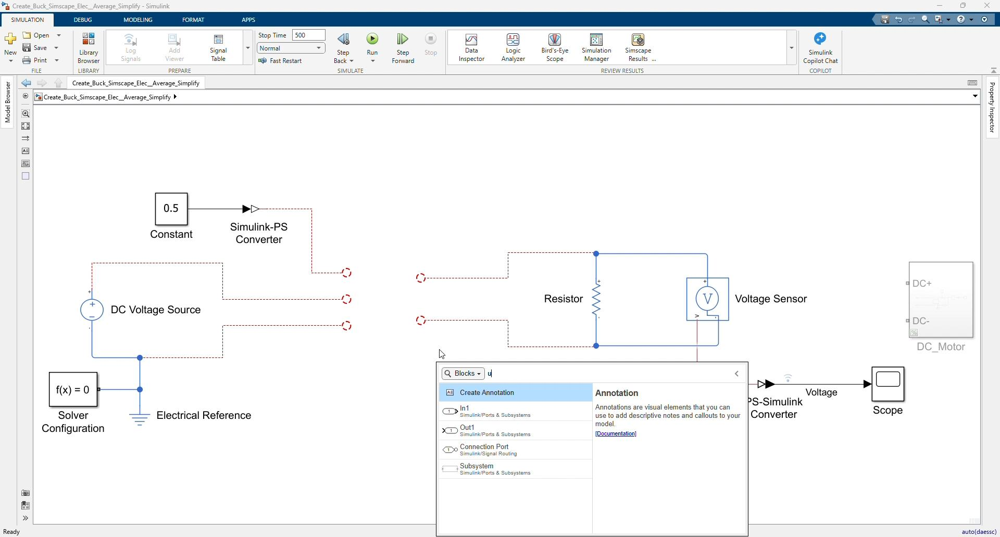
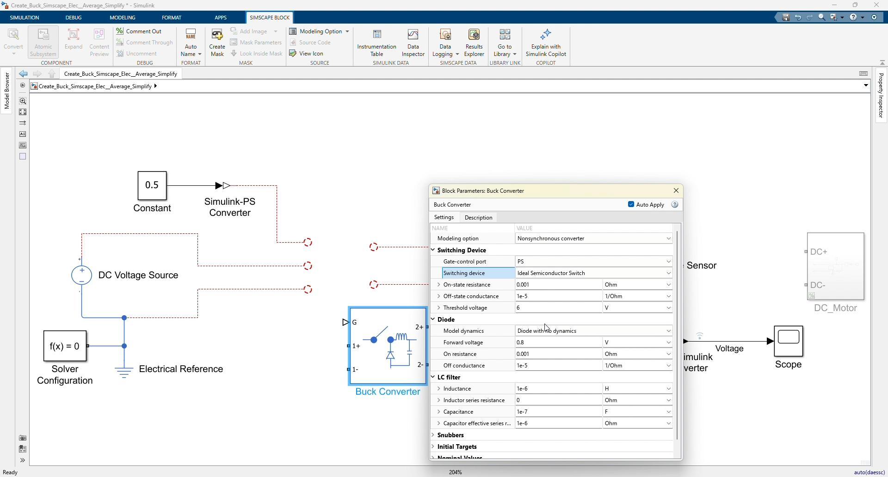
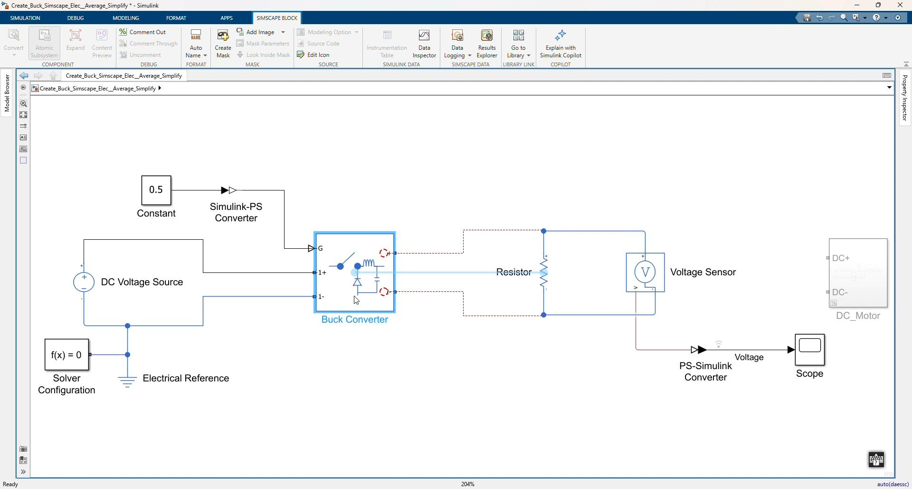
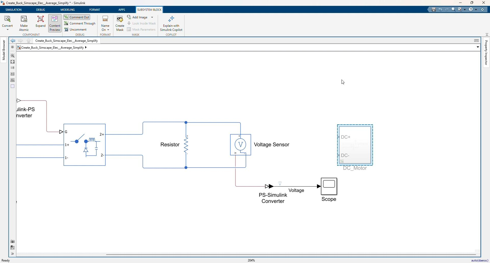
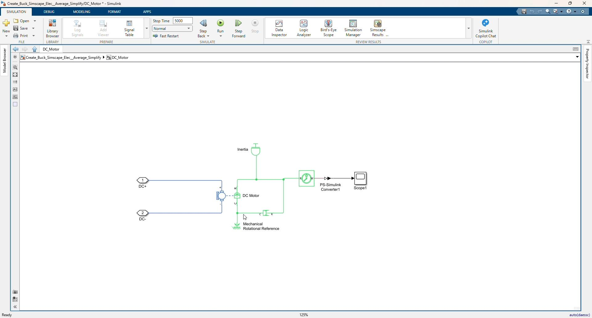
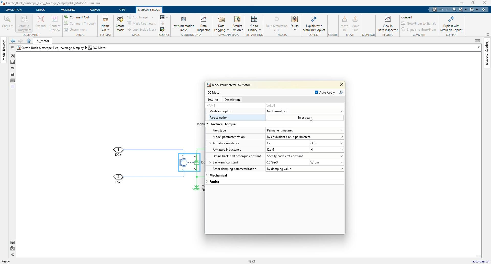
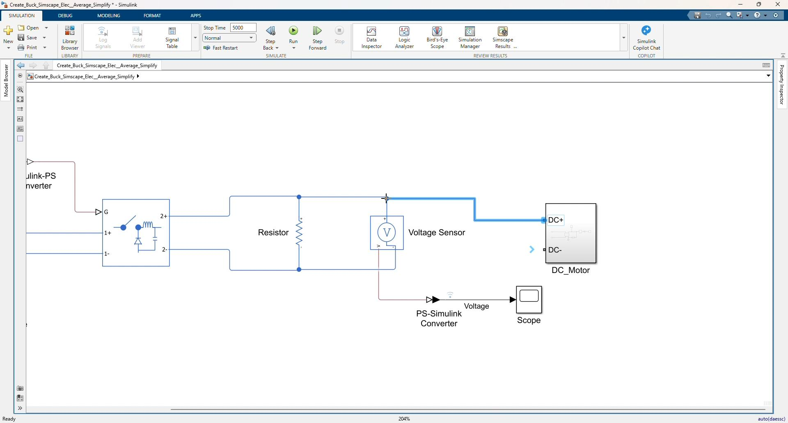
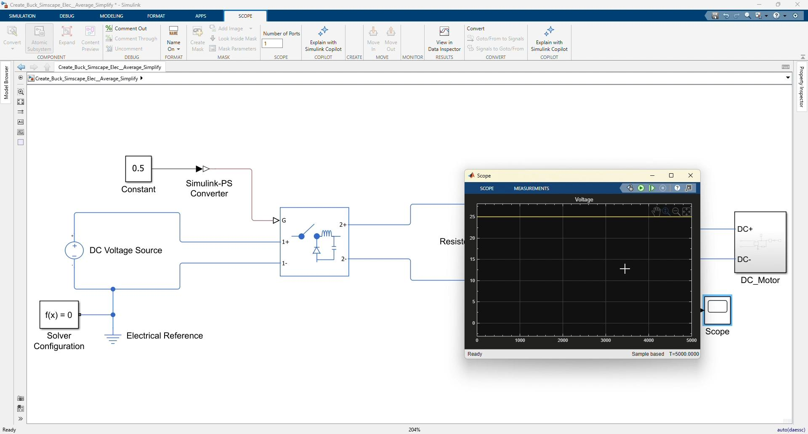
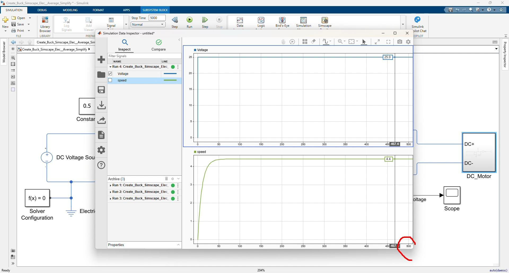

# Workshop 00: Create a Buck Converter with the Average Switch Model

## Goal

Create a simple buck converter using the Simscape Electrical averaged `Buck Converter` block. This workshop follows the clip `00_Create_Buck_Simscape_Average_Simplify.mp4`.

Start from:

```text
Create_Buck_Simscape_Elec__Average_Simplify.slx
```

Use the finished model as the reference:

```text
Create_Buck_Simscape_Elec__Average_Simplify_finished.slx
```

The purpose of this workshop is to show a simplified buck converter workflow before using detailed switching components. The average switch model uses a duty-cycle input directly, so the converter can be simulated quickly without building the MOSFET, diode, inductor, and capacitor from separate blocks.

By the end of this workshop, participants should be able to:

- Add the Simscape Electrical `Buck Converter` block.
- Configure it for averaged switching behavior.
- Drive the converter using a constant duty-cycle command.
- Connect a resistor load and measure the output voltage.
- Add a DC motor load subsystem.
- Compare output voltage and motor speed behavior in Simulation Data Inspector.

## Prerequisites

- MATLAB with Simulink.
- Simscape and Simscape Electrical.
- Model files in `Simplified_Version`.

## Starting Files

| File | Purpose |
|---|---|
| `Create_Buck_Simscape_Elec__Average_Simplify.slx` | Starting model with source, reference, duty signal, resistor load, voltage sensor, converter blocks, and scope |
| `Create_Buck_Simscape_Elec__Average_Simplify_finished.slx` | Finished reference model with the averaged buck converter and DC motor load |

## Starting Model

The starting model contains these main blocks:

| Block | Purpose |
|---|---|
| `DC Voltage Source` | Input supply for the converter |
| `Electrical Reference` | Electrical ground reference |
| `Solver Configuration` | Required Simscape solver block |
| `Constant` | Duty-cycle command |
| `Simulink-PS Converter` | Converts the duty command to a physical signal |
| `Resistor` | Initial electrical load |
| `Voltage Sensor` | Measures output voltage |
| `PS-Simulink Converter` | Converts measured voltage to Simulink |
| `Scope` | Displays the measured voltage |

Detected starting settings:

| Item | Value |
|---|---:|
| Stop time | `500 s` |
| DC source voltage | `50 V` |
| Duty command | `0.5` |
| Resistor load | `1 Ohm` |

## Finished Model Reference

The finished model adds:

| Added Item | Purpose |
|---|---|
| `Buck Converter` | Average switch buck converter stage |
| `DC_Motor` subsystem | Motor load connected to the converter output |
| `Scope1` inside `DC_Motor` | Motor speed display |
| Simulation Data Inspector runs | Compare output voltage and motor speed |

Detected finished settings:

| Item | Value |
|---|---:|
| Stop time | `5000 s` |
| Buck converter device type | Averaged switching device |
| DC source voltage | `50 V` |
| Duty command | `0.5` |
| Resistor load | `1 Ohm` |
| Buck converter inductor `Lf` | `1e-6 H` |
| Buck converter capacitor `Cf` | `1e-7 F` |
| Switch on resistance `Ron` | `0.001 Ohm` |
| Switch off conductance `Goff` | `1e-5 1/Ohm` |

The expected resistor-load output voltage is approximately:

```text
Vout = Duty * Vin = 0.5 * 50 V = 25 V
```

## Workshop Procedure

Follow this order in the workshop:

```text
Open starting model -> Add averaged Buck Converter
-> Configure Buck Converter parameters -> Wire source, duty input, and resistor load
-> Run resistor-load simulation -> View output voltage
-> Create/open DC_Motor subsystem -> Configure DC motor load
-> Connect DC_Motor to converter output -> Run final simulation
-> Compare voltage and motor speed in Simulation Data Inspector
```

### 1. Open the starting average buck model



*Video screenshot: starting model with the prepared source, duty command, resistor load, voltage sensor, and scope.*

1. Open:

   ```text
   Create_Buck_Simscape_Elec__Average_Simplify.slx
   ```

2. Review the prepared blocks:
   - `DC Voltage Source`
   - `Electrical Reference`
   - `Solver Configuration`
   - `Constant`
   - `Simulink-PS Converter`
   - `Resistor`
   - `Voltage Sensor`
   - `PS-Simulink Converter`
   - `Scope`

3. Confirm the duty command is:

   ```text
   0.5
   ```

4. Explain that this duty command will directly control the averaged buck converter.

### 2. Add the Buck Converter block



*Video screenshot: adding the Simscape Electrical Buck Converter block to the model.*

1. Open the Library Browser or use quick insert.
2. Search for:

   ```text
   Buck Converter
   ```

3. Add the Simscape Electrical `Buck Converter` block to the center of the model.
4. Place it between the DC input source and the output load.

Concept to explain:

```text
The Buck Converter block represents the converter power stage as one reusable Simscape block.
For this lesson, it is configured as an averaged model, so it does not require PWM switching pulses.
```

### 3. Configure the Buck Converter as an averaged model



*Video screenshot: Buck Converter block parameters configured for averaged switching behavior.*

Open the `Buck Converter` block parameters.

Confirm or set the converter device type to:

```text
Averaged switching device
```

Use the default/simplified converter parameters shown in the finished model:

| Parameter | Value |
|---|---:|
| Switch on resistance `Ron` | `0.001 Ohm` |
| Switch off conductance `Goff` | `1e-5 1/Ohm` |
| Forward voltage `Vf` | `0.8 V` |
| Filter inductance `Lf` | `1e-6 H` |
| Filter capacitance `Cf` | `1e-7 F` |

The important point is not detailed semiconductor switching. The lesson is about creating a fast average converter model driven by a duty command.

### 4. Connect the DC source to the converter input

Connect the input side of the `Buck Converter`:

```text
DC Voltage Source positive -> Buck Converter p1
DC Voltage Source negative -> Buck Converter n1
Electrical Reference -> DC Voltage Source negative / Buck Converter n1
Solver Configuration -> electrical reference node
```

The input supply is:

```text
50 V
```

### 5. Connect the duty command to the converter gate input

Connect the control signal:

```text
Constant(0.5) -> Simulink-PS Converter -> Buck Converter G
```

Explain:

```text
The averaged Buck Converter block uses this physical-signal input as the duty ratio.
Duty = 0.5 means the ideal average output should be about half of the input voltage.
```

### 6. Connect the resistor load and voltage sensor

Connect the output side of the `Buck Converter`:

```text
Buck Converter p2 -> Resistor positive
Buck Converter n2 -> Resistor negative
Voltage Sensor across the resistor
Voltage Sensor output -> PS-Simulink Converter -> Scope
```

Keep the resistor value:

```text
1 Ohm
```

Name or identify the measured signal as:

```text
Voltage
```

### 7. Run the resistor-load simulation

1. Run the model with the resistor load connected.
2. Open the Scope or Simulation Data Inspector.
3. Confirm the output voltage rises near:

   ```text
   25 V
   ```

4. Explain the relationship:

   ```text
   50 V input * 0.5 duty = about 25 V output
   ```

This validates the basic averaged buck converter connection before adding the motor load.

### 8. Create the DC_Motor subsystem



*Video screenshot: DC_Motor subsystem added at the converter output side.*

Create or open the `DC_Motor` subsystem used in the finished model.

The subsystem has two electrical conserving ports:

```text
DC+
DC-
```

Inside the subsystem, add or review these blocks:

| Block | Purpose |
|---|---|
| `DC Motor` | Electrical-to-rotational motor model |
| `Inertia` | Rotational load inertia |
| `Rotational Damper` | Mechanical damping load |
| `Mechanical Rotational Reference` | Mechanical reference |
| `Ideal Rotational Motion Sensor` | Measures motor speed |
| `PS-Simulink Converter1` | Converts speed to Simulink |
| `Scope1` | Displays motor speed |

### 9. Configure the DC motor load



*Video screenshot: internal DC_Motor subsystem structure with motor, inertia, damper, speed sensor, and scope.*



*Video screenshot: DC Motor block parameter dialog.*

Use the DC motor settings shown in the finished model:

| Parameter | Value |
|---|---:|
| Parameterization | Circuit parameters |
| Armature resistance `Ra` | `3.9 Ohm` |
| Armature inductance `La` | `12e-6 H` |
| Back-emf constant `Kv` | `0.072e-3 V/rpm` |
| Rated voltage | `1.5 V` |
| Rated speed | `15000 rpm` |
| Rated power | `0.08 W` |

Use these mechanical load settings:

| Block | Parameter | Value |
|---|---|---:|
| `Inertia` | Inertia | `0.01 kg*m^2` |
| `Rotational Damper` | Damping | `1e-3 N*m*s/rad` |

Connect the motor mechanical side:

```text
DC Motor R -> Inertia -> Ideal Rotational Motion Sensor -> Rotational Damper
DC Motor C -> Mechanical Rotational Reference
Rotational Damper other side -> Mechanical Rotational Reference
Motion Sensor speed output -> PS-Simulink Converter1 -> Scope1
```

### 10. Connect the DC_Motor subsystem to the converter output



*Video screenshot: DC_Motor subsystem connected in parallel with the resistor load.*

Return to the top-level model.

Connect the motor subsystem in parallel with the resistor and voltage sensor:

```text
Buck Converter p2 -> DC_Motor DC+
Buck Converter n2 -> DC_Motor DC-
```

Keep the voltage sensor across the output node so the voltage can still be measured.

At this point, the converter output supplies:

```text
Resistor load + DC motor load
```

### 11. Increase the stop time for the motor response

Set the model stop time to:

```text
5000
```

The longer stop time is used because the motor mechanical speed response is slower than the electrical voltage response.

### 12. Run the final average buck simulation



*Video screenshot: final simulation result viewed in the Scope.*



*Video screenshot: Simulation Data Inspector showing voltage and motor speed after the final run.*

1. Run the finished model.
2. Open Simulation Data Inspector.
3. Plot the output voltage signal.
4. Plot the motor speed signal.
5. Arrange the plots so voltage and speed can be reviewed together.

Expected discussion:

- The averaged buck converter quickly produces the output voltage.
- With `Vin = 50 V` and `Duty = 0.5`, the voltage is around `25 V`.
- The motor speed rises more slowly because of inertia and damping.
- The average converter model is useful for fast system-level studies where switching ripple is not the focus.

## Suggested Instructor Flow

1. Open `Create_Buck_Simscape_Elec__Average_Simplify.slx`.
2. Review the prepared source, resistor load, duty command, sensor, and scope blocks.
3. Add the `Buck Converter` block.
4. Configure the converter as an averaged switching device.
5. Connect the DC source to `p1` and `n1`.
6. Connect `Constant(0.5)` through `Simulink-PS Converter` to the `G` port.
7. Connect `p2` and `n2` to the resistor load.
8. Connect the voltage sensor and scope.
9. Run and confirm about `25 V` output.
10. Create or open the `DC_Motor` subsystem.
11. Configure the DC motor, inertia, damper, speed sensor, and speed scope.
12. Connect `DC_Motor` in parallel with the resistor at the converter output.
13. Change stop time to `5000`.
14. Run the final simulation.
15. Compare output voltage and motor speed in Simulation Data Inspector.

## Participant Exercise

Ask participants to record:

| Item | Expected Observation |
|---|---|
| Input voltage | `50 V` |
| Duty command | `0.5` |
| Approximate no-motor output voltage | About `25 V` |
| Output load after final connection | Resistor and DC motor in parallel |
| Motor speed behavior | Gradual rise due to inertia and damping |

Optional exercise:

1. Change the duty command to another value such as `0.3` or `0.8`.
2. Run the model again.
3. Observe how the output voltage and motor speed change.

## Troubleshooting

| Symptom | Likely Cause | Fix |
|---|---|---|
| Converter output is zero | Duty input is not connected to `G` | Connect `Constant -> Simulink-PS Converter -> G` |
| Simscape error about missing reference | Electrical reference or solver configuration is not connected | Connect `Electrical Reference` and `Solver Configuration` to the electrical network |
| Voltage is not shown in Scope | Voltage sensor output is not connected through `PS-Simulink Converter` | Connect `Voltage Sensor V -> PS-Simulink Converter -> Scope` |
| Output voltage is not near expected average value | Duty value, source voltage, or converter parameters are different | Check `Vin = 50 V`, `Duty = 0.5`, and Buck Converter settings |
| Motor speed does not plot | Speed sensor or `PS-Simulink Converter1` is not connected | Check `Ideal Rotational Motion Sensor -> PS-Simulink Converter1 -> Scope1` |
| Simulation too short for motor speed response | Stop time is still `500` | Set stop time to `5000` for the final motor-load run |

## Reference Check

Top-level finished model should use this structure:

```text
Constant(0.5) -> Simulink-PS Converter -> Buck Converter G
DC Voltage Source -> Buck Converter input p1/n1
Buck Converter output p2/n2 -> Resistor
Buck Converter output p2/n2 -> Voltage Sensor -> PS-Simulink Converter -> Scope
Buck Converter output p2/n2 -> DC_Motor DC+/DC-
```

`DC_Motor` subsystem should use this structure:

```text
DC+ / DC- -> DC Motor electrical ports
DC Motor shaft -> Inertia and Rotational Damper
Mechanical side -> Mechanical Rotational Reference
Ideal Rotational Motion Sensor -> PS-Simulink Converter1 -> Scope1
```

Key average-switch concept:

```text
The average Buck Converter model uses duty cycle directly.
It is faster for system-level simulation because it does not simulate every PWM switching event.
```
