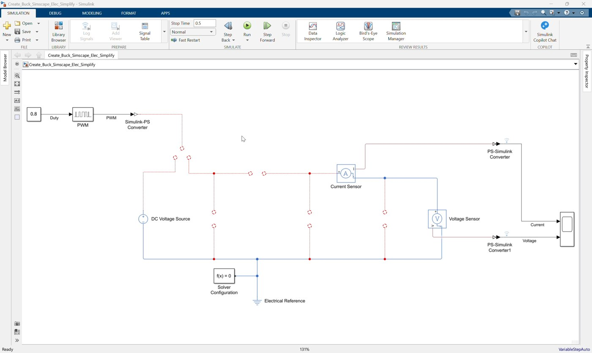
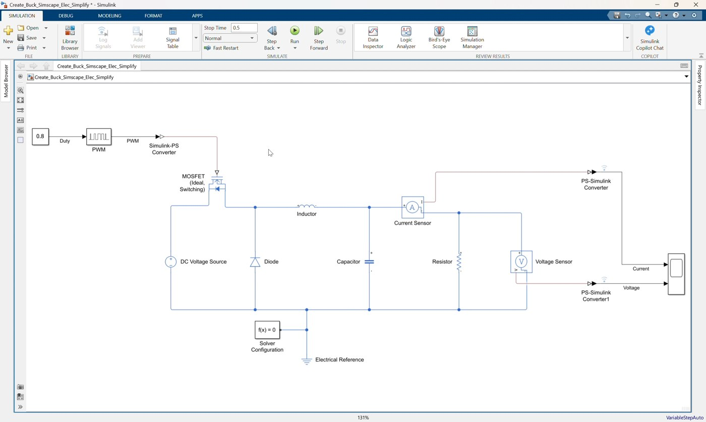
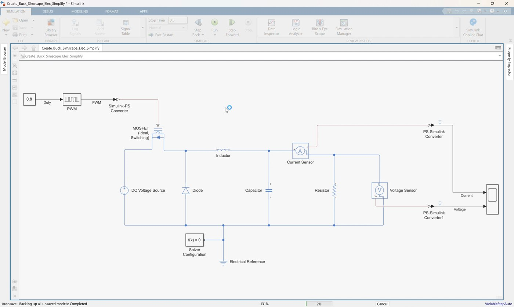
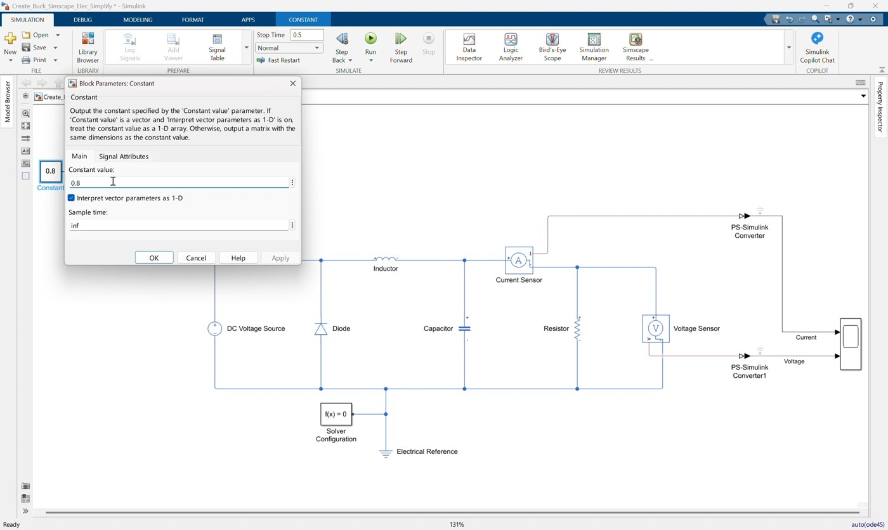
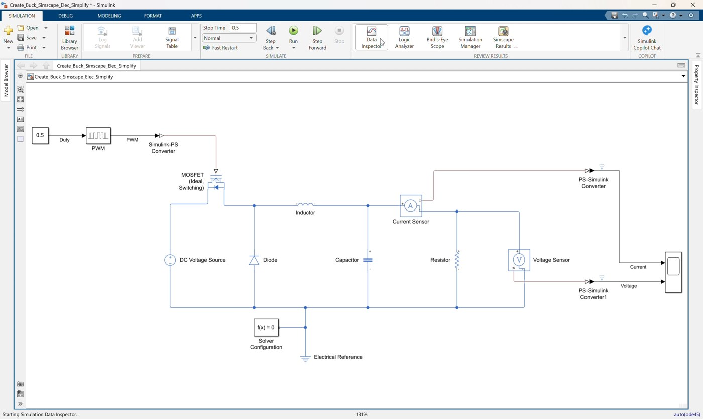
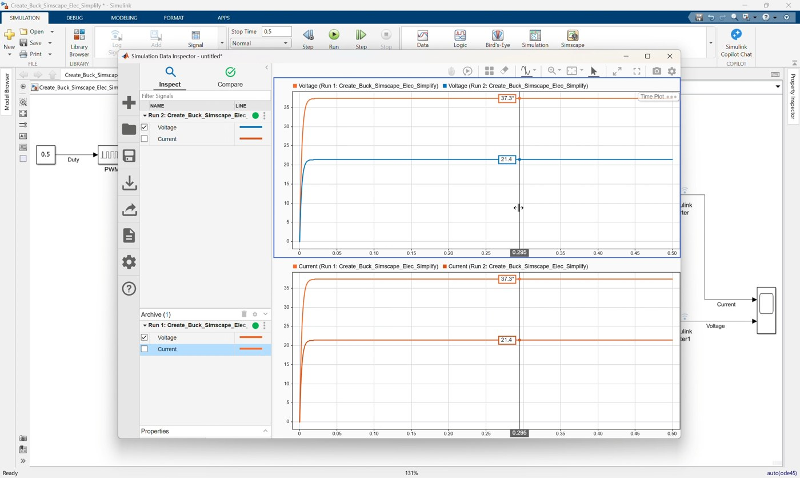

# Workshop 01: Create a Simplified Buck Converter with Simscape Electrical

## Goal

Complete and simulate an open-loop DC-DC buck converter in Simulink using Simscape Electrical. This simplified workshop follows the clip `01_Create_Buck_Simscape_Elec_Simplify.mp4`.

Start from:

```text
Create_Buck_Simscape_Elec_Simplify.slx
```

Finish with a model that matches:

```text
Create_Buck_Simscape_Elec_Simplify_finished.slx
```

The starting model already contains the command, measurement, source, reference, solver, and scope blocks. In this clip, participants complete the physical buck converter power stage and verify the simulation result.

By the end of this workshop, participants should be able to:

- Identify the prepared Simulink and Simscape blocks in the starting model.
- Add the missing buck converter power-stage components.
- Connect the MOSFET, diode, inductor, capacitor, and load resistor correctly.
- Drive the MOSFET with the existing PWM physical signal.
- Measure output current and voltage using the prepared sensors and Scope.
- Run the simulation and confirm the expected buck converter output.

## Prerequisites

- MATLAB with Simulink.
- Simscape.
- Simscape Electrical.
- Basic understanding of a buck converter: switch, diode, inductor, capacitor, and load.

## Starting Model

Open `Create_Buck_Simscape_Elec_Simplify.slx`.

The model already includes:

| Existing Block | Purpose |
|---|---|
| `DC Voltage Source` | Provides the input voltage |
| `Constant` | Provides the duty-cycle command |
| `PWM` | Converts duty cycle into a pulse-width-modulated signal |
| `Simulink-PS Converter` | Converts the PWM signal into a physical signal for the MOSFET gate |
| `Current Sensor` | Measures output/load current |
| `Voltage Sensor` | Measures output voltage |
| Two `PS-Simulink Converter` blocks | Convert physical sensor outputs to Simulink signals |
| `Scope` | Displays current and voltage |
| `Electrical Reference` | Provides the electrical ground/reference |
| `Solver Configuration` | Required for the Simscape physical network |

The starting model is intentionally incomplete. The missing pieces are the switching device, freewheeling diode, inductor, output capacitor, and load resistor.

## Reference Values

Use these values during the workshop:

| Item | Value |
|---|---:|
| DC input voltage | `50 V` |
| Initial duty cycle in starting model | `0.8` |
| Final duty cycle in finished model | `0.5` |
| PWM period | `1e-5 s` |
| Inductor | `3e-3 H` |
| Inductor resistance | `0 Ohm` |
| Capacitor | `1e-5 F` |
| Load resistor | `1 Ohm` |
| Diode on resistance | `0.3 Ohm` |
| Diode off conductance | `1e-8 S` |
| MOSFET off conductance | `1e-6 1/Ohm` |
| Simulation stop time | `0.5 s` |

Expected ideal steady-state output voltage before changing duty cycle:

```text
Vout = Duty * Vin = 0.8 * 50 = 40 V
```

Expected ideal steady-state output voltage after changing duty cycle to match the finished model:

```text
Vout = Duty * Vin = 0.5 * 50 = 25 V
```

The simulated voltage may not be exactly `40 V` or `25 V` because the model includes non-ideal switching and diode parameters, but it should be close to the expected buck converter behavior.

## Blocks to Add

Add these blocks to the starting model.

| Block | Library Path | Main Setting |
|---|---|---|
| `MOSFET (Ideal, Switching)` | Simscape > Electrical > Semiconductors & Converters | `Goff = 1e-6 1/Ohm` |
| `Diode` | Simscape > Electrical > Semiconductors & Converters | `Ron = 0.3 Ohm`, `Goff = 1e-8 S` |
| `Inductor` | Simscape > Electrical > Passive | `l = 3e-3 H`, `r = 0 Ohm` |
| `Capacitor` | Simscape > Foundation Library > Electrical > Electrical Elements | `c = 1e-5 F` |
| `Resistor` | Simscape > Foundation Library > Electrical > Electrical Elements | `R = 1 Ohm` |

## Workshop Procedure

Follow this order in the workshop:

```text
Review starting model -> Add switching stage -> Add diode and inductor
-> Add output filter/load -> Connect measurements -> Check infrastructure
-> Change duty cycle -> Configure and save -> Simulate and inspect
```

### 1. Open and review the starting model



*Video screenshot: the prepared starting model before completing the buck converter power stage.*

1. Open `Create_Buck_Simscape_Elec_Simplify.slx`.
2. Confirm that the following prepared blocks are already present:
   - `DC Voltage Source`
   - `Constant`
   - `PWM`
   - `Simulink-PS Converter`
   - `Current Sensor`
   - `Voltage Sensor`
   - Two `PS-Simulink Converter` blocks
   - `Scope`
   - `Electrical Reference`
   - `Solver Configuration`
3. Observe that the source positive terminal, current sensor input, and PWM physical-signal output are not yet connected into a complete converter circuit.

### 2. Add the MOSFET switch

1. Add a `MOSFET (Ideal, Switching)` block.
2. Set or confirm the MOSFET off conductance:

   ```text
   Goff = 1e-6 1/Ohm
   ```

3. Connect the positive terminal of the `DC Voltage Source` to the MOSFET drain terminal `D`.
4. Connect the physical-signal output of the `Simulink-PS Converter` to the MOSFET gate terminal `G`.
5. Leave the MOSFET source terminal `S` available as the switching node.

### 3. Add the freewheeling diode

1. Add a `Diode` block.
2. Set the diode parameters:

   ```text
   Ron = 0.3 Ohm
   Goff = 1e-8 S
   ```

3. Connect the diode negative terminal to the MOSFET source terminal `S`.
4. Connect the diode positive terminal to the electrical return node.

The diode provides the freewheeling path when the MOSFET is off.

### 4. Add the inductor

1. Add an `Inductor` block.
2. Set the inductor parameters:

   ```text
   l = 3e-3 H
   r = 0 Ohm
   ```

3. Connect the inductor input terminal to the MOSFET source/switching node.
4. Connect the inductor output terminal to the positive side of the output current path.

In the finished model, the inductor output connects to the current sensor input and the capacitor positive terminal.

### 5. Add the output capacitor

1. Add a `Capacitor` block.
2. Set the capacitance:

   ```text
   c = 1e-5 F
   ```

3. Connect the capacitor positive terminal to the output node after the inductor.
4. Connect the capacitor negative terminal to the electrical return node.

The capacitor smooths the switched waveform at the converter output.

### 6. Add the load resistor

1. Add a `Resistor` block.
2. Set the resistance:

   ```text
   R = 1 Ohm
   ```

3. Connect the resistor positive terminal to the current sensor output/output voltage node.
4. Connect the resistor negative terminal to the electrical return node.

The resistor represents the load of the buck converter.

### 7. Complete the measurement connections



*Video screenshot: current and voltage measurement paths connected to the Scope.*

1. Confirm the `Current Sensor` is in series between the output capacitor side of the inductor and the load resistor.
2. Confirm the current sensor physical-signal output is connected to the first `PS-Simulink Converter`.
3. Confirm the first `PS-Simulink Converter` output is connected to Scope input 1.
4. Confirm the `Voltage Sensor` is connected across the output node and electrical return node.
5. Confirm the voltage sensor physical-signal output is connected to the second `PS-Simulink Converter`.
6. Confirm the second `PS-Simulink Converter` output is connected to Scope input 2.

Suggested Scope signal order:

```text
Scope input 1: Output current
Scope input 2: Output voltage
```

### 8. Check the Simscape infrastructure



*Video screenshot: completed physical network with electrical reference and solver configuration.*

1. Confirm the `Electrical Reference` is connected to the converter return node.
2. Confirm the `Solver Configuration` block is connected to the same physical electrical network.
3. Confirm the negative terminal of the `DC Voltage Source`, diode return, capacitor return, resistor return, voltage sensor return, electrical reference, and solver configuration all share the same return node.

The model will not simulate correctly unless the physical network has both an electrical reference and solver configuration.

### 9. Set the duty-cycle command



*Video screenshot: changing the Constant block duty-cycle value from the initial case to the final case.*

1. Open the `Constant` block.
2. Confirm the starting value is `0.8`.
3. Explain that this initial value would produce an ideal buck output of:

   ```text
   Vout = 0.8 * 50 = 40 V
   ```

4. Change the `Constant` value to `0.5`.
5. Confirm the `Constant` output is connected to the `PWM` block.
6. Confirm the `PWM` block output is connected to the `Simulink-PS Converter`.

This final command produces a 50 percent duty-cycle PWM signal for the MOSFET and matches `Create_Buck_Simscape_Elec_Simplify_finished.slx`.

### 10. Configure and save the model



*Video screenshot: completed buck converter model before the final simulation check.*

1. Set the simulation stop time to:

   ```text
   0.5
   ```

2. Review the circuit from left to right:

   ```text
   DC source -> MOSFET -> Inductor -> Current Sensor -> Load
   ```

3. Save the completed model.

If you want to compare against the provided completed file, open:

```text
Create_Buck_Simscape_Elec_Simplify_finished.slx
```

### 11. Simulate and inspect the result



*Video screenshot: Simulation Data Inspector result after running the completed model.*

1. Click Run.
2. Open the `Scope`.
3. Confirm the current signal appears on Scope input 1.
4. Confirm the voltage signal appears on Scope input 2.
5. Compare the output voltage against the ideal estimate:

   ```text
   Vout = 0.5 * 50 = 25 V
   ```

The voltage should rise toward the expected buck converter output level, with transient behavior at startup.

## Suggested Instructor Flow

1. Start by explaining that the simplified model already contains the command and measurement infrastructure.
2. Ask participants to identify which blocks are already prepared and which power-stage components are missing.
3. Leave the initial duty cycle at `0.8` while completing the circuit.
4. Add and connect the MOSFET first so participants can identify the switching node.
5. Add the diode and explain the freewheeling path.
6. Add the inductor, capacitor, and resistor to complete the output stage.
7. After the wiring check, ask participants to estimate the output for `Duty = 0.8`.
8. Change the duty cycle to `0.5` so the model matches the finished file.
9. Run the model and compare the Scope result with the expected `25 V`.

## Participant Exercise

After completing the finished model, ask participants to compare the two duty-cycle cases:

1. Run the model with the final duty cycle `0.5`.
2. Confirm the expected ideal output voltage is approximately `25 V`.
3. Change the duty cycle back to `0.8`.
4. Predict the new ideal output voltage.
5. Run the simulation again.
6. Compare the Scope result with the estimate.

Expected ideal value:

```text
Vout = 0.8 * 50 = 40 V
```

## Troubleshooting

| Symptom | Likely Cause | Fix |
|---|---|---|
| Model does not run | Missing or disconnected `Solver Configuration` | Connect `Solver Configuration` to the physical electrical network |
| Electrical network error | Missing or disconnected `Electrical Reference` | Connect `Electrical Reference` to the return node |
| MOSFET does not switch | PWM physical signal is not connected to MOSFET gate | Connect `Simulink-PS Converter` output to MOSFET `G` |
| Source positive terminal is still open | MOSFET drain is not connected | Connect `DC Voltage Source` positive terminal to MOSFET `D` |
| No output voltage | Inductor, resistor, or capacitor output node is incomplete | Check the output node and return-node wiring |
| Scope has no current or voltage signal | Sensor physical outputs are not connected to converters | Check both `PS-Simulink Converter` connections |
| Output voltage is unexpected | Duty cycle, source voltage, diode orientation, or MOSFET orientation is incorrect | Check `Duty = 0.5` for the finished model, `Vin = 50 V`, and the switching-node connections |

## Reference Model Check

The completed model should follow this connection structure:

```text
Constant -> PWM -> Simulink-PS Converter -> MOSFET gate
DC Voltage Source positive -> MOSFET drain
MOSFET source -> switching node
Diode from return node to switching node
Switching node -> Inductor -> Current Sensor -> output/load node
Output/load node -> Resistor -> return node
Inductor output side -> Capacitor -> return node
Output/load node -> Voltage Sensor positive
Voltage Sensor negative -> return node
Current Sensor signal -> PS-Simulink Converter -> Scope input 1
Voltage Sensor signal -> PS-Simulink Converter -> Scope input 2
Electrical Reference and Solver Configuration connected to the return node
```
