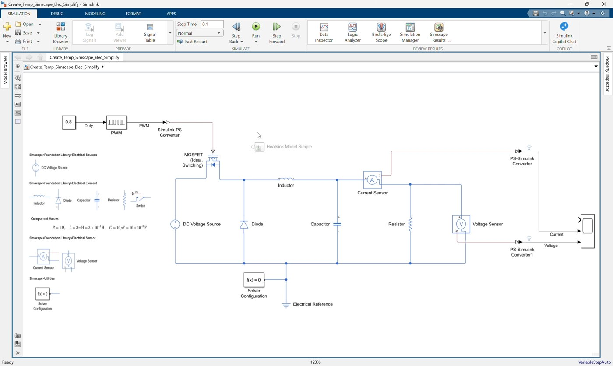
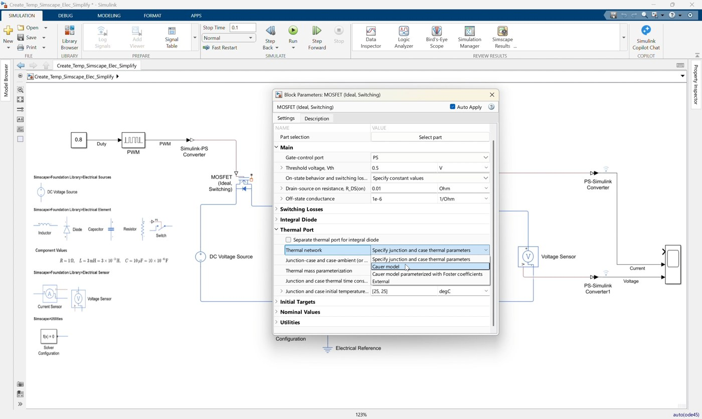
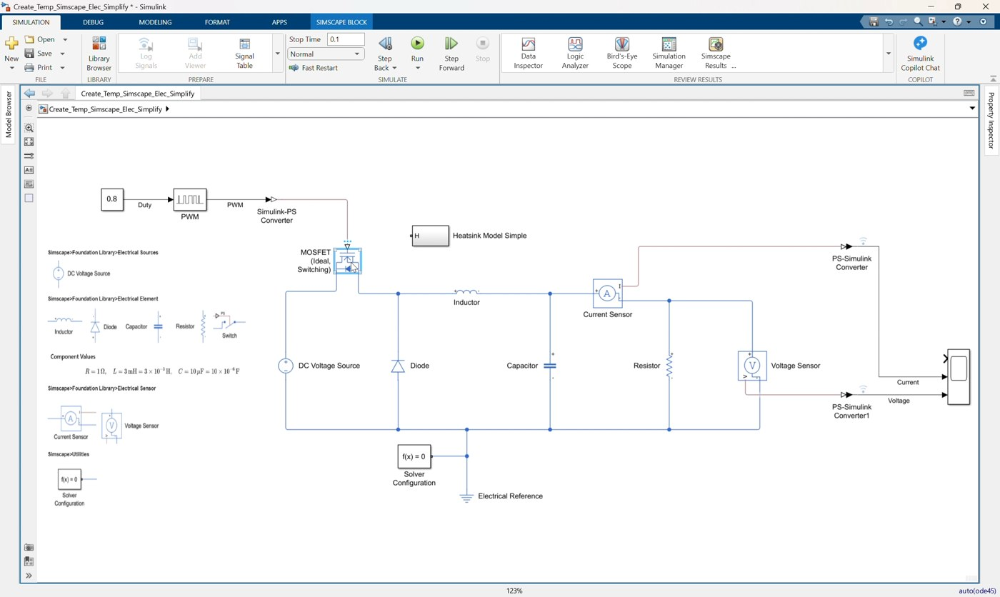
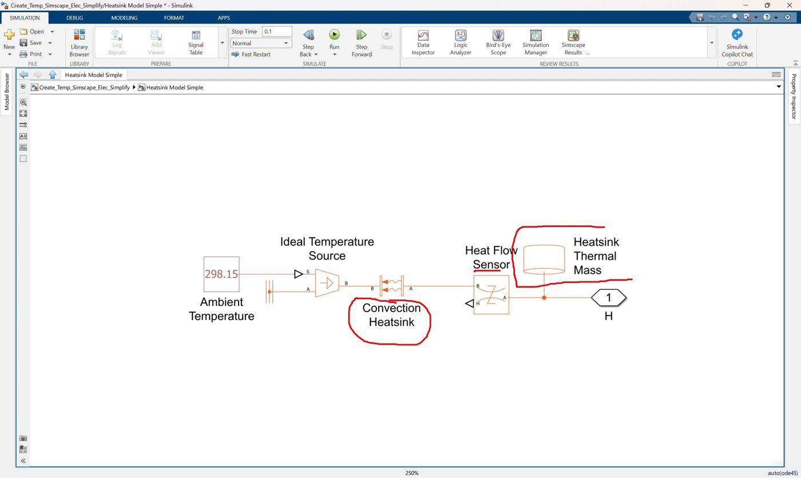
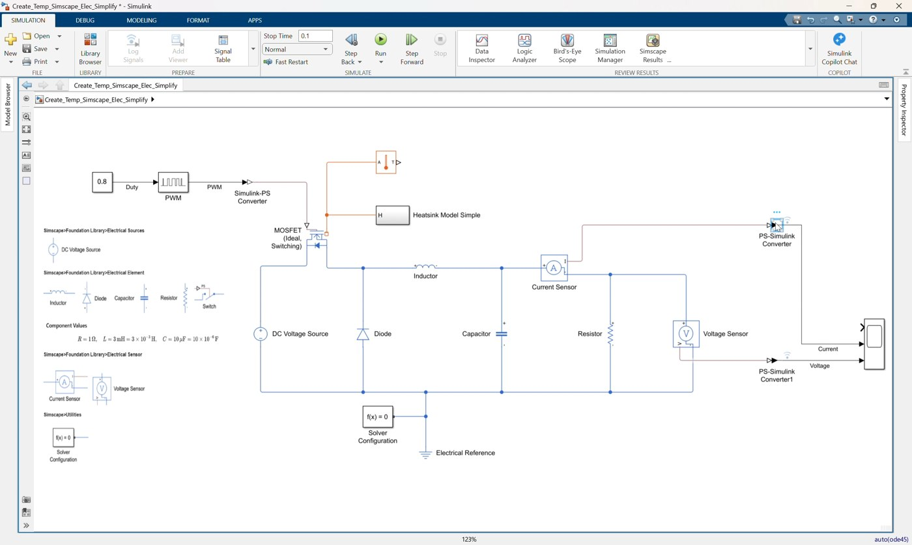
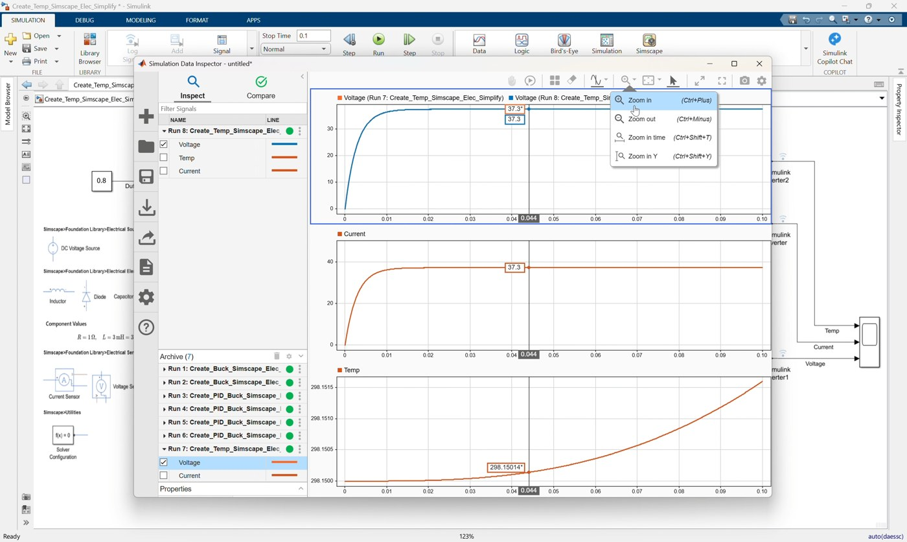
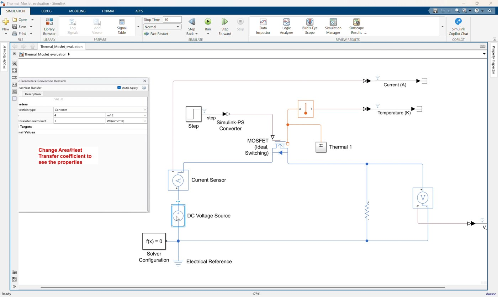
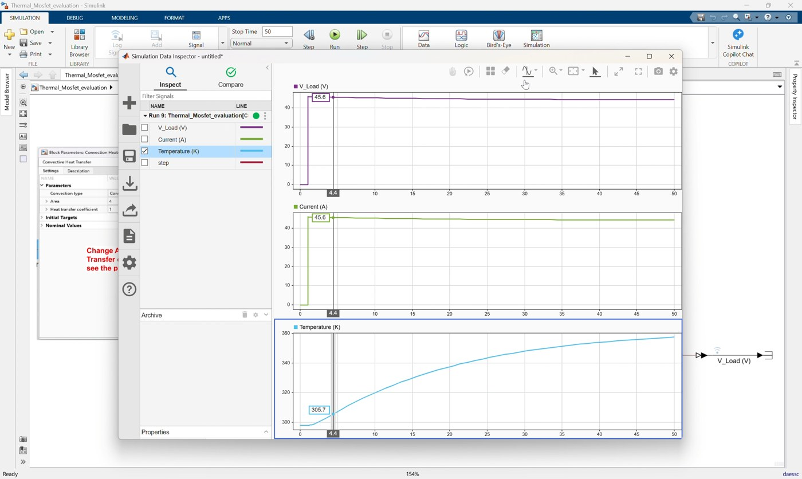
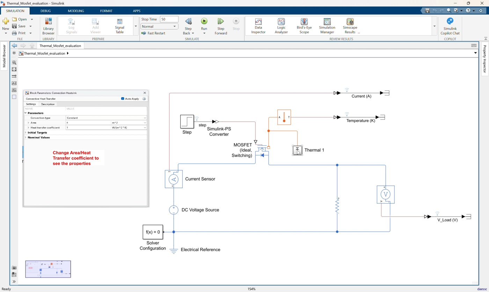
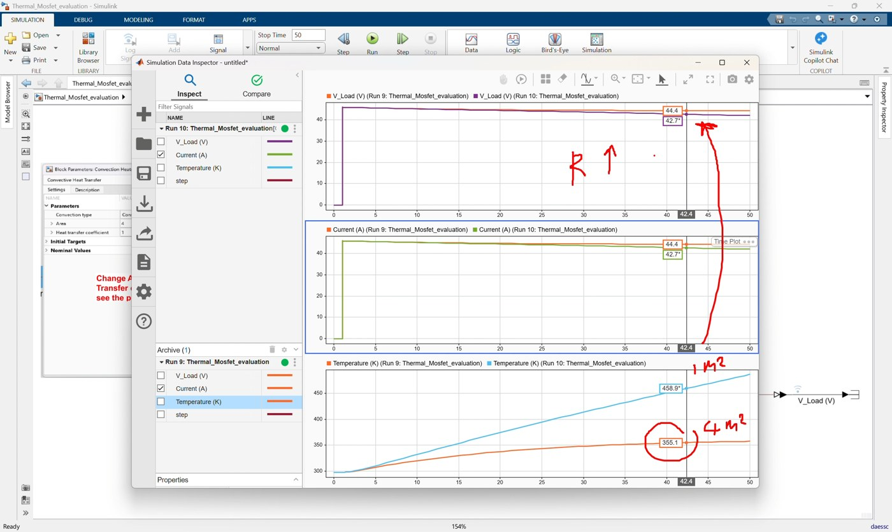

# Workshop 02: Add MOSFET Thermal Behavior to the Simplified Buck Converter

## Goal

Extend the simplified buck converter model with MOSFET thermal behavior, then use a second evaluation model to show the thermal effect more clearly. This workshop follows the clip `02_Create_Temp_Simscape_Elec_Simplify.mp4`.

The clip has two sessions:

1. Start from `Create_Temp_Simscape_Elec_Simplify.slx` and finish with `Create_Temp_Simscape_Elec_Simplify_finished.slx`.
2. Open `Thermal_Mosfet_evaluation.slx` and use it to compare MOSFET temperature behavior when the heatsink convection setting changes.

By the end of this workshop, participants should be able to:

- Enable the thermal port on a Simscape Electrical MOSFET.
- Connect the MOSFET thermal port to a heatsink thermal network.
- Add a temperature sensor and route MOSFET temperature to the Scope.
- Run a coupled electro-thermal simulation.
- Use `Thermal_Mosfet_evaluation.slx` to make thermal differences easier to observe.

## Prerequisites

- MATLAB with Simulink.
- Simscape.
- Simscape Electrical.
- Completed understanding of Workshop 01 buck converter operation.

## Reference Values

### Session 1: Thermal Buck Converter

| Item | Value |
|---|---:|
| DC input voltage | `50 V` |
| Duty cycle | `0.8` |
| PWM period | `1e-5 s` |
| Inductor | `3e-3 H` |
| Capacitor | `1e-5 F` |
| Load resistor | `1 Ohm` |
| MOSFET off conductance | `1e-6 1/Ohm` |
| MOSFET on resistance | `0.01 Ohm` |
| MOSFET thermal network | Junction-case |
| MOSFET thermal mass | `[3, 25] J/K` |
| Initial MOSFET junction temperature | `25 degC` |
| Heatsink convection area | `1 m^2` |
| Heat transfer coefficient | `1 W/(m^2*K)` |
| Heatsink mass | `0.01 kg` |
| Initial heatsink temperature | `298.15 K` |
| Ambient temperature | `298.15 K` |
| Simulation stop time | `0.1 s` |

### Session 2: Thermal Evaluation Model

| Item | Value |
|---|---:|
| DC input voltage | `50 V` |
| Load resistor | `1 Ohm` |
| Step time | `1 s` |
| Step initial value | `0` |
| Step final value | `1` |
| Heatsink convection area baseline | `1 m^2` |
| Heat transfer coefficient | `1 W/(m^2*K)` |
| Heatsink mass | `0.01 kg` |
| Ambient temperature | `298.15 K` |
| Simulation stop time | `50 s` |

## Session 1: Add Thermal Behavior to the Buck Converter

Start from:

```text
Create_Temp_Simscape_Elec_Simplify.slx
```

Finish with:

```text
Create_Temp_Simscape_Elec_Simplify_finished.slx
```

The starting model already contains the electrical buck converter from Workshop 01. The Scope already has three inputs, but the first Scope input is not connected yet. In this session, that first Scope input is used for MOSFET temperature.

### 1. Open and review the starting model



*Video screenshot: the starting simplified buck converter before adding the MOSFET thermal path.*

1. Open `Create_Temp_Simscape_Elec_Simplify.slx`.
2. Confirm the electrical buck converter is already complete:
   - `DC Voltage Source`
   - `MOSFET (Ideal, Switching)`
   - `Diode`
   - `Inductor`
   - `Capacitor`
   - `Resistor`
   - `Current Sensor`
   - `Voltage Sensor`
   - `PWM`
   - `Simulink-PS Converter`
   - Two `PS-Simulink Converter` blocks
   - `Scope`
   - `Electrical Reference`
   - `Solver Configuration`
3. Confirm the model still uses duty cycle `0.8`.
4. Observe that the MOSFET does not yet expose a thermal conserving port.

### 2. Enable the MOSFET thermal port



*Video screenshot: enabling the MOSFET thermal network so the block exposes thermal port `H`.*

1. Open the block parameters for `MOSFET (Ideal, Switching)`.
2. Enable the thermal port or thermal network option.
3. Select the junction-case thermal network.
4. Confirm the key MOSFET thermal settings:

   ```text
   Thermal network = Junction-case
   Thermal mass = [3, 25] J/K
   Initial MOSFET junction temperature = 25 degC
   ```

5. Apply the parameter change.
6. Confirm the MOSFET block now shows a thermal conserving port `H`.

### 3. Add the heatsink subsystem



*Video screenshot: the `Heatsink Model Simple` subsystem used for MOSFET heat removal.*

1. Add or paste the subsystem `Heatsink Model Simple` into the model.
2. Confirm the subsystem has one thermal conserving port named `H`.
3. Connect the MOSFET thermal port `H` to the `Heatsink Model Simple` thermal port.

The heatsink subsystem represents heat removal from the MOSFET to ambient.

### 4. Review the heatsink subsystem



*Video screenshot: internal thermal blocks inside the heatsink subsystem.*

1. Open `Heatsink Model Simple`.
2. Confirm the subsystem contains:
   - `Ambient Temperature`
   - `Convection Heatsink`
   - `Heat Flow Sensor`
   - `Heatsink Thermal Mass`
   - `Ideal Temperature Source`
   - `Thermal Reference`
3. Confirm the main parameter values:

   ```text
   Ambient temperature = 298.15 K
   Convection area = 1 m^2
   Heat transfer coefficient = 1 W/(m^2*K)
   Heatsink mass = 0.01 kg
   Initial heatsink temperature = 298.15 K
   ```

4. Return to the top level of `Create_Temp_Simscape_Elec_Simplify.slx`.

### 5. Add MOSFET temperature measurement



*Video screenshot: temperature measurement routed to the first Scope input.*

1. Add a `Temperature Sensor`.
2. Connect the sensor thermal port to the same thermal node as the MOSFET thermal port and `Heatsink Model Simple`.
3. Add a `PS-Simulink Converter`.
4. Connect the temperature sensor physical signal output to the new converter.
5. Connect the new converter output to Scope input 1.
6. Name the signal `Temperature`.

Suggested Scope signal order:

```text
Scope input 1: Temperature
Scope input 2: Current
Scope input 3: Voltage
```

### 6. Configure and run the thermal buck converter



*Video screenshot: simulation result after adding MOSFET temperature measurement.*

1. Set the simulation stop time to:

   ```text
   0.1
   ```

2. Run the model.
3. Open the Scope.
4. Confirm the Scope shows:
   - MOSFET temperature.
   - Output current.
   - Output voltage.
5. Save the completed model.

The result should match the structure of `Create_Temp_Simscape_Elec_Simplify_finished.slx`.

### 7. Explain the Session 1 result

Use this model to explain that the same electrical buck converter can be extended with a thermal domain. The MOSFET still works as the switching device, but its losses now create heat flow into the connected heatsink network.

The temperature change in this short `0.1 s` buck converter simulation may be small. The second session uses a simpler thermal evaluation model so the thermal effect is easier to see.

## Session 2: Use the MOSFET Thermal Evaluation Model

Use this model:

```text
Thermal_Mosfet_evaluation.slx
```

This model isolates the MOSFET, load, heatsink, and temperature measurement so convection changes produce a clearer thermal response over a longer simulation.

### 1. Open and review the evaluation model



*Video screenshot: the simplified thermal MOSFET evaluation model.*

1. Open `Thermal_Mosfet_evaluation.slx`.
2. Review the simplified circuit:
   - `DC Voltage Source`: `50 V`
   - `Current Sensor`
   - `MOSFET (Ideal, Switching)` with thermal port enabled
   - `Resistor`: `1 Ohm`
   - `Voltage Sensor`
   - `Step` gate command through a `Simulink-PS Converter`
   - `Temperature Sensor`
   - `Thermal 1` heatsink subsystem
3. Confirm the Step block uses:

   ```text
   Step time = 1 s
   Initial value = 0
   Final value = 1
   ```

4. Confirm the simulation stop time is:

   ```text
   50
   ```

### 2. Inspect the Thermal 1 subsystem

1. Open the subsystem `Thermal 1`.
2. Locate the `Convection Heatsink` block.
3. Confirm the baseline settings:

   ```text
   Convection area = 1 m^2
   Heat transfer coefficient = 1 W/(m^2*K)
   ```

4. Confirm the heatsink thermal mass settings:

   ```text
   Heatsink mass = 0.01 kg
   Initial heatsink temperature = 298.15 K
   ```

5. Return to the top level.

### 3. Run the baseline case



*Video screenshot: baseline thermal evaluation run with convection area at `1 m^2`.*

1. Keep the convection area at `1 m^2`.
2. Run the simulation.
3. Inspect the logged results for:
   - `Temperature (K)`
   - `Current (A)`
   - `V_Load (V)`
4. Use the baseline case as the reference cooling condition.

### 4. Increase the convection area



*Video screenshot: changing the convection area for the improved cooling case.*

1. Open `Thermal 1`.
2. Open `Convection Heatsink`.
3. Change the convection area from the baseline value to:

   ```text
   Convection area = 4 m^2
   ```

4. Run the simulation again.
5. Compare the temperature response with the baseline case.

Expected observation:

- Larger convection area removes heat more effectively.
- MOSFET temperature rises less or settles at a lower value.
- The thermal effect is easier to see than in the short buck converter simulation.

### 5. Compare the two thermal cases



*Video screenshot: comparison between the `1 m^2` and `4 m^2` convection-area runs.*

Use the evaluation model to compare:

| Case | Convection Area | Expected Temperature Behavior |
|---|---:|---|
| Baseline cooling | `1 m^2` | Higher temperature rise |
| Improved cooling | `4 m^2` | Lower temperature rise |

The exact temperature values depend on model settings and solver behavior. The important concept is the trend: stronger convection produces better cooling.

## Suggested Instructor Flow

1. Open `Create_Temp_Simscape_Elec_Simplify.slx`.
2. Point out that the electrical buck converter is already complete.
3. Enable the MOSFET thermal port and explain the new thermal conserving port.
4. Add `Heatsink Model Simple` and connect it to the MOSFET thermal port.
5. Add the `Temperature Sensor` and route temperature to Scope input 1.
6. Run the model and show that electrical and thermal behavior now simulate together.
7. Open `Thermal_Mosfet_evaluation.slx`.
8. Run the baseline case.
9. Change the `Convection Heatsink` area and compare the temperature response.
10. Close by explaining that thermal parameters such as convection area, heat transfer coefficient, heatsink mass, and ambient temperature can be changed directly in the physical model.

## Participant Exercise

Ask participants to run two cases in `Thermal_Mosfet_evaluation.slx`:

| Case | Convection Area |
|---|---:|
| Baseline cooling | `1 m^2` |
| Improved cooling | `4 m^2` |

For each case, record:

- Final MOSFET temperature.
- Peak MOSFET temperature.
- Whether the temperature rises quickly or slowly.

Then ask:

```text
Which convection area gives the lowest MOSFET temperature?
Why does increasing convection area improve cooling?
```

## Troubleshooting

| Symptom | Likely Cause | Fix |
|---|---|---|
| MOSFET has no thermal port | Thermal port option is not enabled | Open MOSFET parameters and enable the thermal network/thermal port |
| Thermal network error | Heatsink subsystem is disconnected or missing thermal reference | Check `Heatsink Model Simple` or `Thermal 1` connections |
| Scope input 1 is empty | Temperature converter is not connected | Connect `Temperature Sensor` to `PS-Simulink Converter2`, then to Scope input 1 |
| Temperature changes very little in Session 1 | Buck converter simulation is short | Use `Thermal_Mosfet_evaluation.slx` for a clearer 50-second thermal comparison |
| Results do not clearly differ in Session 2 | Convection area was not changed or the wrong run is being inspected | Compare the baseline `1 m^2` run with the updated `4 m^2` run |

## Reference Model Check

Session 1 completed model should include this added thermal path:

```text
MOSFET thermal port H -> Heatsink Model Simple
MOSFET thermal node -> Temperature Sensor -> PS-Simulink Converter -> Scope input 1
Existing Current Sensor -> PS-Simulink Converter -> Scope input 2
Existing Voltage Sensor -> PS-Simulink Converter -> Scope input 3
```

Session 2 evaluation model should support this comparison:

```text
Step -> Simulink-PS Converter -> MOSFET gate
DC Voltage Source -> Current Sensor -> MOSFET -> Resistor -> Electrical Reference
MOSFET thermal port -> Thermal 1 subsystem
MOSFET thermal node -> Temperature Sensor -> PS-Simulink Converter
Change Thermal 1 / Convection Heatsink / area to compare cooling behavior
```
