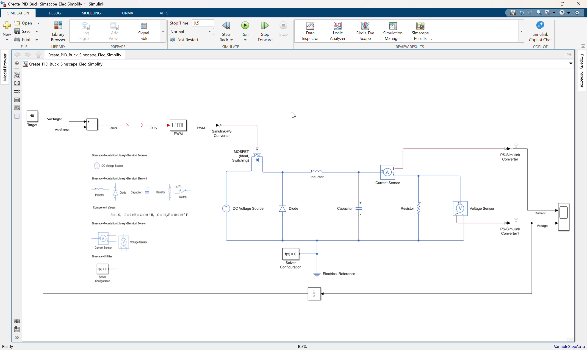
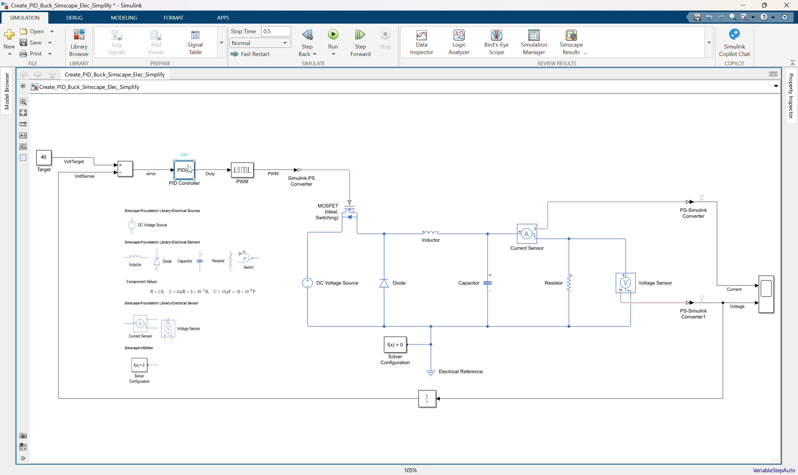
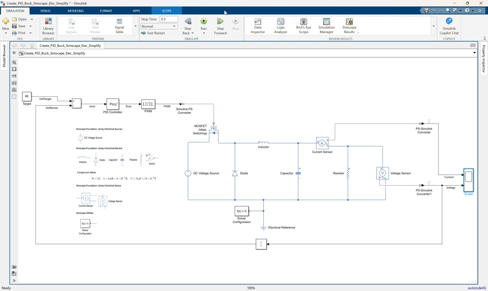
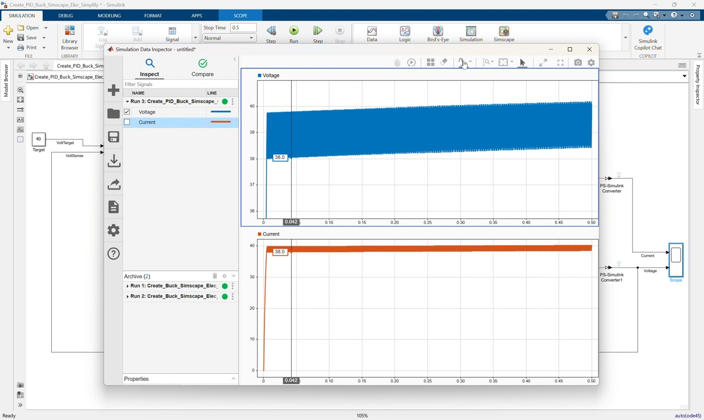
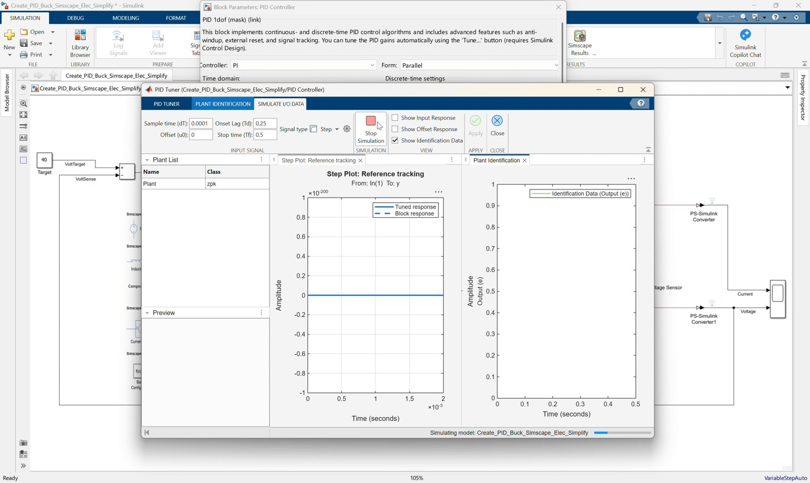
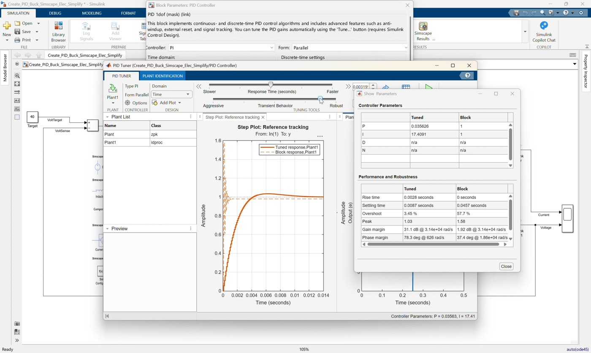
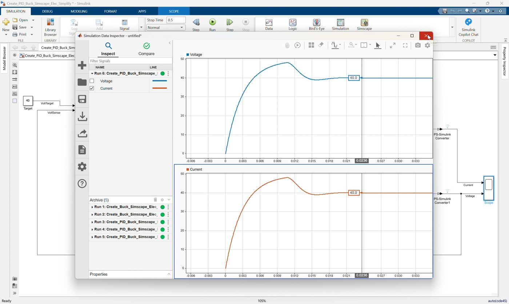

# Workshop 03: Add a PI Controller to the Simplified Buck Converter

## Goal

Complete a closed-loop voltage controller for the simplified Simscape buck converter. This workshop follows the clip `03_Create_PID_Buck_Simscape_Elec_Simplify.mp4`.

Start from:

```text
Create_PID_Buck_Simscape_Elec_Simplify.slx
```

Finish with a model that matches:

```text
Create_PID_Buck_Simscape_Elec_Simplify_finished.slx
```

The starting model already contains the buck converter plant, output voltage feedback, target voltage, and error calculation. In this clip, participants add the missing PI controller, connect it to the PWM duty input, tune the gains, and validate the closed-loop voltage response.

By the end of this workshop, participants should be able to:

- Explain why fixed-duty open-loop control is not enough for voltage regulation.
- Identify the prepared feedback path in the simplified PID model.
- Add a `PID Controller` block as a PI controller.
- Limit the controller output so PWM duty stays between `0` and `1`.
- Connect the error signal to the controller and the controller output to the PWM block.
- Tune and validate the closed-loop buck converter response.

## Prerequisites

- MATLAB with Simulink.
- Simscape.
- Simscape Electrical.
- Basic understanding of the simplified buck converter from Workshop 01.
- Basic understanding of feedback control: target, measured output, error, controller, actuator.

## Starting Model

Open `Create_PID_Buck_Simscape_Elec_Simplify.slx`.

The model already includes:

| Existing Block | Purpose |
|---|---|
| `DC Voltage Source` | Provides the input voltage |
| `MOSFET (Ideal, Switching)` | Switching device |
| `Diode` | Freewheeling path |
| `Inductor`, `Capacitor`, `Resistor` | Buck converter output stage and load |
| `Current Sensor` | Measures output/load current |
| `Voltage Sensor` | Measures output voltage |
| `PS-Simulink Converter` blocks | Convert physical sensor signals to Simulink signals |
| `Scope` | Displays current and voltage |
| `Target` | Provides the desired output voltage |
| `Subtract` | Calculates voltage error |
| `Unit Delay` | Provides delayed measured-voltage feedback |
| `PWM` | Converts duty command into a PWM signal |
| `Simulink-PS Converter` | Converts PWM into a physical gate signal |
| `Electrical Reference` and `Solver Configuration` | Required Simscape infrastructure |

The starting model is intentionally incomplete: the PWM input is not driven by a controller yet.

## Reference Values

Use these values during the workshop:

| Item | Value |
|---|---:|
| DC input voltage | `50 V` |
| Output voltage target | `40 V` |
| PWM period | `1e-5 s` |
| Controller type | `PI` |
| Controller form | `Parallel` |
| Controller time domain | Discrete-time |
| Controller sample time | `1e-4 s` |
| Proportional gain `P` | `0.0244696968424815` |
| Integral gain `I` | `23.7511768764149` |
| Derivative gain `D` | `0` |
| Output lower saturation | `0` |
| Output upper saturation | `1` |
| Simulation stop time | `0.5 s` |

The controller output is the PWM duty command, so it must stay in the valid range:

```text
0 <= Duty <= 1
```

## Workshop Procedure

Follow this order in the workshop:

```text
Review prepared model -> Explain feedback loop -> Add PI controller
-> Configure controller -> Connect controller to PWM -> Estimate plant
-> Tune with PID Tuner sliders -> Simulate -> Save completed model
```

### 1. Open and review the prepared PID model



*Video screenshot: prepared simplified buck converter model with target, feedback, and open PWM input.*

1. Open `Create_PID_Buck_Simscape_Elec_Simplify.slx`.
2. Confirm that the buck converter electrical plant is already complete.
3. Confirm the `Target` block is set to:

   ```text
   40
   ```

4. Confirm the `Voltage Sensor` output is converted by `PS-Simulink Converter1`.
5. Confirm the voltage signal is routed to:
   - Scope input 2.
   - `Unit Delay`.
6. Confirm `Target` and delayed voltage feedback connect to `Subtract`.
7. Observe that the `Subtract` output is the voltage error:

   ```text
   error = Vtarget - Vout
   ```

8. Observe that the `PWM` block input is still open.

### 2. Explain the closed-loop control path

Explain the intended signal flow:

```text
Target voltage -> Subtract -> PI Controller -> PWM -> MOSFET gate
Measured output voltage -> Unit Delay -> Subtract feedback input
```

The controller adjusts duty cycle automatically. If output voltage is below the `40 V` target, the error becomes positive and the PI controller increases duty cycle. If output voltage is too high, the controller reduces duty cycle.

### 3. Add the PID Controller block



*Video screenshot: adding the PID Controller block between error and PWM.*

1. Add a `PID Controller` block near the `Subtract` and `PWM` blocks.
2. Rename it `PID Controller` if needed.
3. Place it between the `Subtract` output and the `PWM` input.

The controller block will convert voltage error into duty-cycle command.

### 4. Configure the PID Controller as PI

1. Open the `PID Controller` block parameters.
2. Set the controller type to:

   ```text
   PI
   ```

3. Set the form to:

   ```text
   Parallel
   ```

4. Set the time domain to:

   ```text
   Discrete-time
   ```

5. Set the sample time:

   ```text
   1e-4
   ```

### 5. Enter initial PI settings

Enter simple initial gains so the controller block is valid before tuning:

```text
P = 1
I = 1
D = 0
N = 100
```

These initial values are only a starting point. The final gains will be calculated with PID Tuner after estimating a plant from the Simscape model.

### 6. Enable controller output saturation

1. In the `PID Controller` block, enable output saturation.
2. Set the saturation limits:

   ```text
   Lower saturation limit = 0
   Upper saturation limit = 1
   ```

3. Keep anti-windup mode as:

   ```text
   none
   ```

The saturation limits are required because the PWM duty command cannot be less than `0` or greater than `1`.

### 7. Connect the controller



*Video screenshot: PI controller output connected to the PWM duty input.*

1. Connect the `Subtract` output to the `PID Controller` input.
2. Name this signal:

   ```text
   error
   ```

3. Connect the `PID Controller` output to the `PWM` input.
4. Name this signal:

   ```text
   Duty
   ```

5. Confirm the existing path remains connected:

   ```text
   PWM -> Simulink-PS Converter -> MOSFET gate
   ```

### 8. Check the Scope signals



*Video screenshot: checking current and voltage signals before tuning.*

1. Confirm Scope input 1 receives output current.
2. Confirm Scope input 2 receives output voltage.
3. Confirm the voltage signal is also used for feedback through the `Unit Delay`.

Suggested Scope signal order:

```text
Scope input 1: Output current
Scope input 2: Output voltage
```

### 9. Open PID Tuner and estimate a plant



*Video screenshot: PID Tuner estimating a plant by simulating and linearizing the Simscape model.*

1. Open the `PID Controller` block.
2. Click `Tune`.
3. In PID Tuner, use the plant estimation or plant linearization workflow.
4. Choose to estimate a new plant by linearizing the Simulink model.
5. Use the prepared closed-loop model signals:

   ```text
   Plant input: duty command entering the PWM block
   Plant output: measured output voltage from PS-Simulink Converter1
   ```

6. Linearize the model at an operating point near the nominal converter condition:

   ```text
   Target voltage = 40 V
   Nominal duty region = around 0.8
   ```

7. Create or update the plant model in PID Tuner.

The buck converter is a nonlinear switching Simscape model. PID Tuner needs a linear plant approximation, so this step estimates a local linear plant around the selected operating point.

### 10. Tune the PI response with PID Tuner



*Video screenshot: tuning the PI response using the PID Tuner response and transient-behavior controls.*

1. Keep the controller type as `PI`.
2. Use the PID Tuner response sliders to adjust the controller:
   - Move the response-time slider to make the response faster or slower.
   - Move the transient-behavior slider to make the response more aggressive or more robust.
3. Watch the reference-tracking plot while adjusting the sliders.
4. Aim for:
   - Stable response.
   - Output voltage tracking near `40 V`.
   - Reasonable rise and settling behavior.
   - No excessive oscillation.
   - Duty command remaining within the valid `0` to `1` range.
5. Apply the tuned controller back to the Simulink model.

The finished model uses these tuned PI gains:

```text
P = 0.0244696968424815
I = 23.7511768764149
D = 0
N = 100
```

The exact values can vary slightly depending on the operating point and slider positions, but the final model should use the tuned PI controller from PID Tuner.

### 11. Configure, simulate, and save the model



*Video screenshot: final simulation response after applying the tuned PI controller.*

1. Set the simulation stop time to:

   ```text
   0.5
   ```

2. Run the model.
3. Open the Scope.
4. Confirm the output voltage moves toward the `40 V` target.
5. Confirm the current response is reasonable and the simulation completes without duty-cycle errors.
6. Save the completed model.
7. Open the provided finished model if you want to compare:

   ```text
   Create_PID_Buck_Simscape_Elec_Simplify_finished.slx
   ```

8. Confirm the completed model has this control path:

   ```text
   Target -> Subtract -> PID Controller -> PWM
   Voltage Sensor -> PS-Simulink Converter1 -> Unit Delay -> Subtract
   ```

## Control Discussion

Use the result to explain the control improvement:

- Open-loop fixed duty uses a constant duty command and cannot correct tracking error.
- Closed-loop PI control uses measured output voltage feedback.
- The PI controller adjusts duty to reduce the error between `Target` and measured output voltage.
- Saturation keeps the requested duty command physically valid for the PWM block.
- PID Tuner does not directly tune the nonlinear switching waveform. It first uses a linearized plant model around the operating point, then tunes the PI controller against that estimated plant.

## Suggested Instructor Flow

1. Start by explaining that the plant and feedback signal are already prepared.
2. Point out the open `PWM` input and the prepared `Subtract` error signal.
3. Explain `error = Vtarget - Vout`.
4. Add the `PID Controller` block between `Subtract` and `PWM`.
5. Configure the controller as a discrete-time PI controller.
6. Enter simple initial gains, then enable saturation from `0` to `1`.
7. Open PID Tuner from the controller block.
8. Estimate a new plant by linearizing the Simscape model at the operating point.
9. Tune the PI response using the PID Tuner sliders.
10. Apply the tuned gains back to the model.
11. Run the model and compare the voltage response against the `40 V` target.
12. Close by explaining that this is the first closed-loop voltage regulator in the workshop sequence.

## Participant Exercise

Ask participants to try these controller cases:

| Case | Controller Setup | Expected Result |
|---|---|---|
| No controller | PWM input not driven | Model cannot regulate the converter |
| Initial PI | `P = 1`, `I = 1` before tuning | Basic closed-loop behavior, not final |
| PID Tuner PI | Tuned from estimated plant | Tracks near the `40 V` target |

For each valid case, record:

- Final output voltage.
- Settling behavior.
- Whether the response is slow, oscillatory, or well damped.

## Troubleshooting

| Symptom | Likely Cause | Fix |
|---|---|---|
| PWM input is still open | PID output was not connected | Connect `PID Controller` output to `PWM` input |
| Output voltage moves away from target | Feedback sign is wrong | Use `Target` on the positive Sum input and measured voltage on the negative input |
| Duty command is invalid | PID output saturation is disabled | Enable saturation and set limits to `0` and `1` |
| Output response is too slow | PI gains are too small | Increase gains or use the reference tuned gains |
| Output oscillates | PI gains are too aggressive | Reduce gains or retune the controller |
| Scope does not show voltage | Voltage sensor converter is disconnected | Check `Voltage Sensor -> PS-Simulink Converter1 -> Scope input 2` |
| PID Tuner cannot tune directly | The Simscape buck converter is nonlinear and switching | Estimate a new plant by linearizing the model at an operating point |
| Tuned response does not look right | Operating point or slider settings are not suitable | Re-estimate the plant near the nominal operating point and adjust response/transient sliders |

## Reference Model Check

The completed model should follow this signal structure:

```text
Target 40 V -> Subtract positive input
Voltage Sensor -> PS-Simulink Converter1 -> Unit Delay -> Subtract negative input
Subtract -> PID Controller -> PWM
PWM -> Simulink-PS Converter -> MOSFET gate
Current Sensor -> PS-Simulink Converter -> Scope input 1
Voltage Sensor -> PS-Simulink Converter1 -> Scope input 2
```

Reference controller settings:

```text
Controller = PI
Form = Parallel
Time domain = Discrete-time
Sample time = 1e-4
P = 0.0244696968424815
I = 23.7511768764149
D = 0
Output saturation = on
Lower saturation limit = 0
Upper saturation limit = 1
Simulation stop time = 0.5
```
