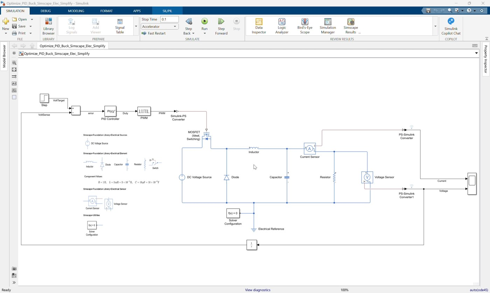
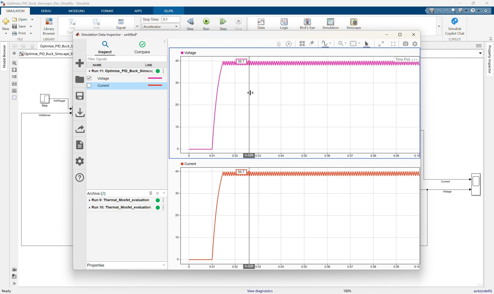
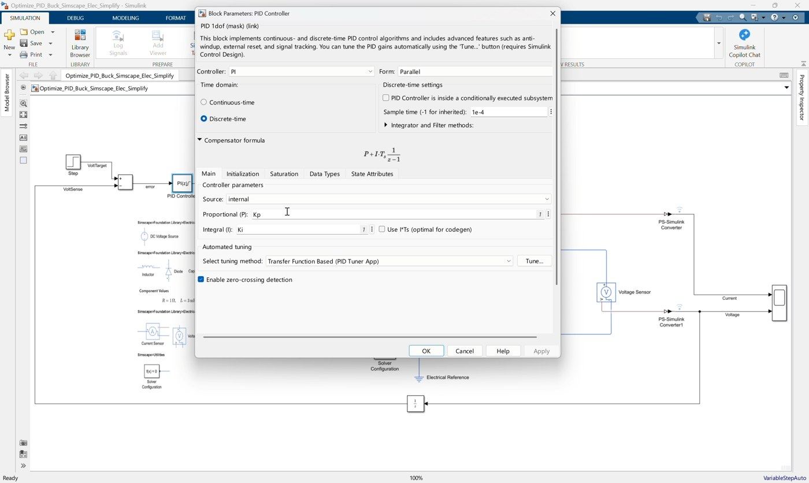
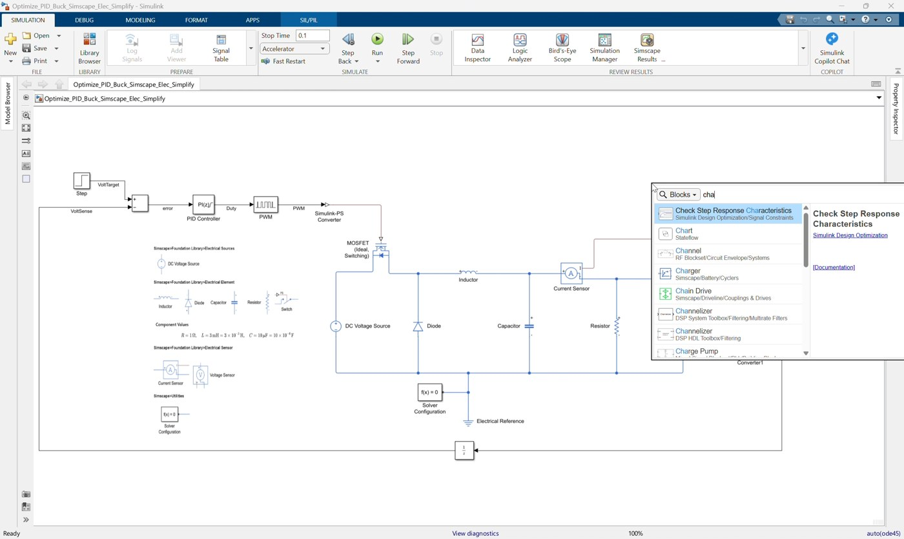
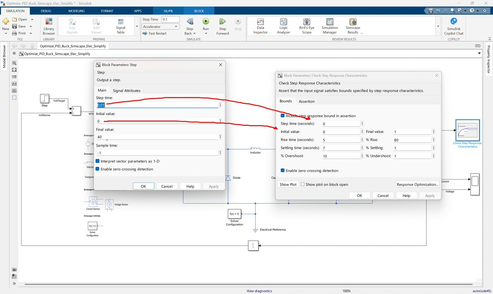
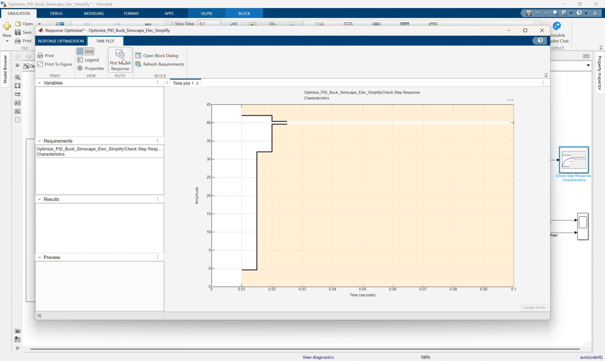
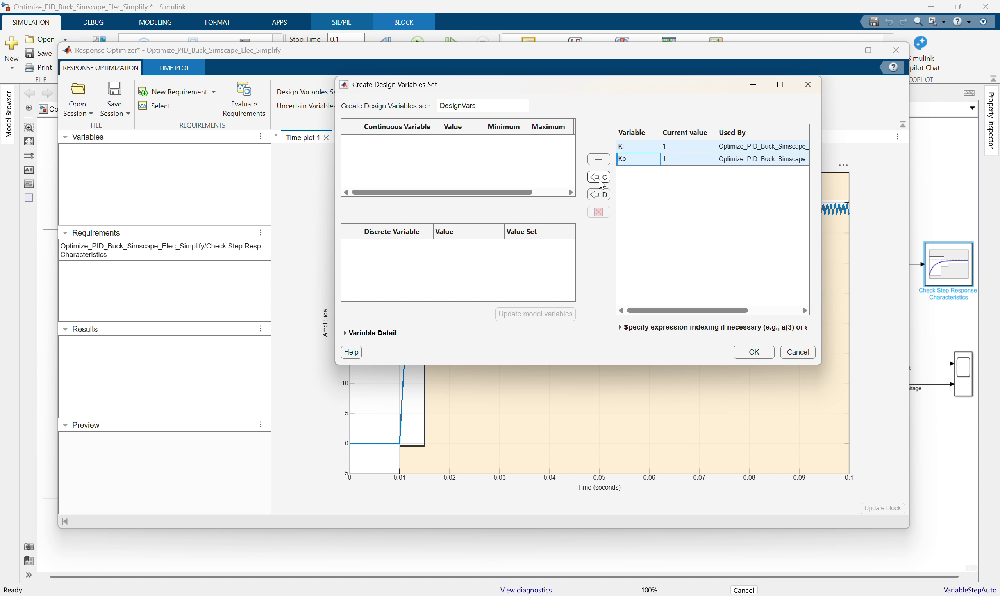
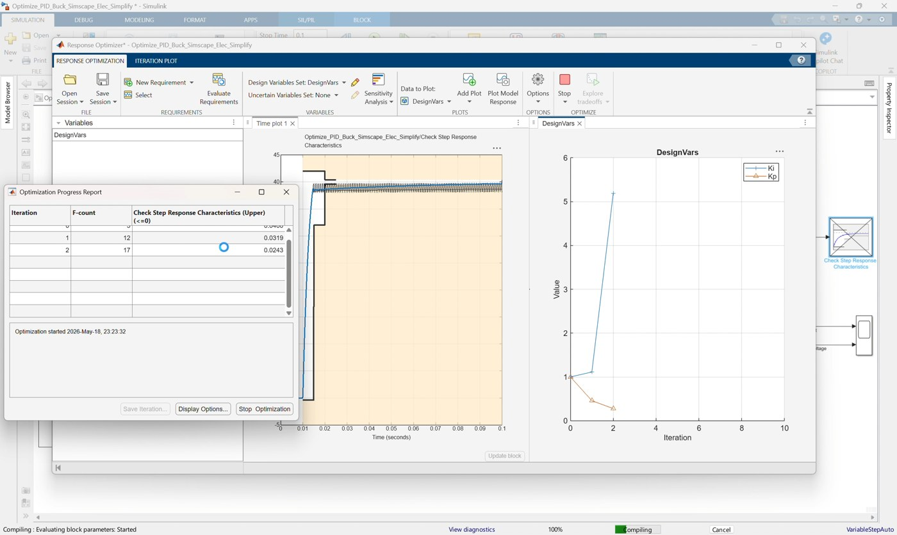
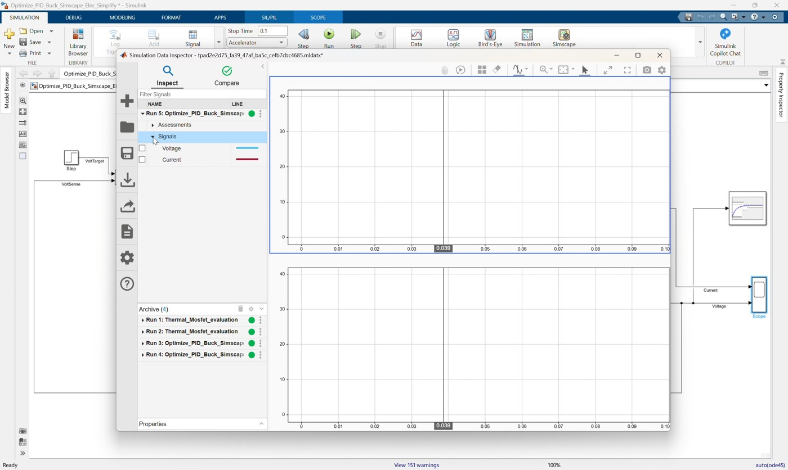
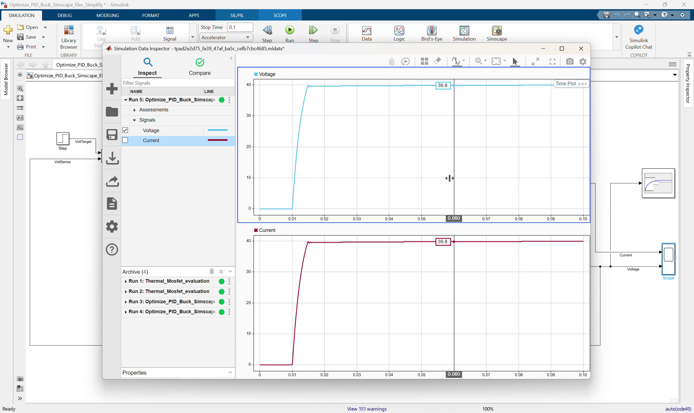

# Workshop 04: Optimize PI Gains for the Simplified Buck Converter

## Goal

Use Simulink Response Optimizer to tune the PI controller gains for the simplified buck converter against a time-domain step response requirement. This workshop follows the clip `04_Optimize_PID_Buck_Simscape_Elec_Simplify.mp4`.

Start from:

```text
Optimize_PID_Buck_Simscape_Elec_Simplify.slx
```

Finish with a model that matches:

```text
Optimize_PID_Buck_Simscape_Elec_Simplify_finished.slx
```

The starting model already contains the closed-loop buck converter from Workshop 03, a Step voltage command, and a PI controller that uses workspace variables `Kp` and `Ki`. In this workshop, participants add a step-response requirement, open Response Optimizer, select `Kp` and `Ki` as design variables, run an optimization, and validate the optimized response.

By the end of this workshop, participants should be able to:

- Add a response requirement block to a measured voltage signal.
- Configure step response requirements such as rise time, settling time, and overshoot.
- Use workspace variables `Kp` and `Ki` as tunable controller parameters.
- Open Simulink Response Optimizer.
- Select design variables and run simulation-based optimization.
- Validate the optimized PI controller on the nonlinear Simscape buck converter.

## Prerequisites

- MATLAB with Simulink.
- Simscape.
- Simscape Electrical.
- Simulink Design Optimization.
- Completed Workshop 03 PID/PI buck converter workflow.

## Starting Model

Open `Optimize_PID_Buck_Simscape_Elec_Simplify.slx`.

The model already includes:

| Existing Block | Purpose |
|---|---|
| `Step` | Provides a voltage target command |
| `Subtract` | Calculates voltage error |
| `PID Controller` | PI controller using `Kp` and `Ki` |
| `PWM` | Converts controller output duty command into PWM |
| `Simulink-PS Converter` | Drives the MOSFET gate with a physical signal |
| Buck converter power stage | Simscape plant |
| `Voltage Sensor` and `PS-Simulink Converter1` | Measures output voltage |
| `Current Sensor` and `PS-Simulink Converter` | Measures output current |
| `Scope` | Displays current and voltage |

The model is intentionally missing the response requirement block used by Response Optimizer.

## Reference Values

Use these values during the workshop:

| Item | Value |
|---|---:|
| DC input voltage | `50 V` |
| Step initial value | `0 V` |
| Step final value | `40 V` |
| Step time | `0.01 s` |
| PI proportional gain parameter | `Kp` |
| PI integral gain parameter | `Ki` |
| Initial `Kp` | `1` |
| Initial `Ki` | `1` |
| Controller type | `PI` |
| Controller form | `Parallel` |
| Controller sample time | `1e-4 s` |
| PID output lower saturation | `0` |
| PID output upper saturation | `1` |
| PWM period | `1e-5 s` |
| Simulation mode | `accelerator` |
| Simulation stop time | `0.5 s` |

Reference response requirement settings in the finished model:

| Requirement Item | Value |
|---|---:|
| Initial value | `0` |
| Final value | `40` |
| Step time | `0.01 s` |
| Rise time | `0.005 s` |
| Settling time | `0.01 s` |
| Percent overshoot | `5%` |

## Workshop Procedure

Follow this order in the workshop:

```text
Review model -> Check Step target and Kp/Ki controller -> Add response requirement
-> Configure step response bound -> Open Response Optimizer
-> Select requirement and design variables -> Use accelerator/Fast Restart
-> Optimize -> Apply/verify optimized gains -> Validate in Simulink
```

### 1. Open and review the starting optimization model



*Video screenshot: starting optimization model with the closed-loop buck converter already prepared.*

1. Open `Optimize_PID_Buck_Simscape_Elec_Simplify.slx`.
2. Confirm the model has the closed-loop control path:

   ```text
   Step -> Subtract -> PID Controller -> PWM
   Voltage Sensor -> PS-Simulink Converter1 -> Unit Delay -> Subtract
   ```

3. Confirm the PI controller output still drives the PWM block.
4. Confirm the output voltage signal is available from `PS-Simulink Converter1`.

### 2. Review the Step voltage target



*Video screenshot: Step command used as the voltage target for response optimization.*

1. Open the `Step` block.
2. Confirm the settings:

   ```text
   Step time = 0.01
   Initial value = 0
   Final value = 40
   ```

The Step command gives Response Optimizer a clear voltage response to evaluate.

### 3. Review the tunable PI controller



*Video screenshot: PID Controller configured to use workspace variables `Kp` and `Ki`.*

1. Open the `PID Controller` block.
2. Confirm the controller type is:

   ```text
   PI
   ```

3. Confirm proportional gain is:

   ```text
   Kp
   ```

4. Confirm integral gain is:

   ```text
   Ki
   ```

5. Confirm output saturation is enabled:

   ```text
   Lower limit = 0
   Upper limit = 1
   ```

Using `Kp` and `Ki` lets Response Optimizer vary those values without changing the block structure.

### 4. Confirm workspace variables


*Video screenshot: model setup before optimizing the `Kp` and `Ki` variables.*

1. In the MATLAB base workspace or model workspace, define initial values if they are not already present:

   ```matlab
   Kp = 1;
   Ki = 1;
   ```

2. Update the model so the PID block can resolve both variables.
3. If the model reports an undefined variable error, define `Kp` and `Ki` before opening Response Optimizer.

### 5. Add the step response requirement block



*Video screenshot: adding the Check Step Response Characteristics requirement block.*

1. Open the Library Browser.
2. Add:

   ```text
   Simulink Design Optimization > Signal Constraints > Check Step Response Characteristics
   ```

3. Place it near the measured voltage signal.
4. Connect the converted output voltage signal from `PS-Simulink Converter1` to the requirement block.

Use the converted Simulink voltage signal, not the physical signal from the voltage sensor.

### 6. Configure the step response requirement



*Video screenshot: configuring the response envelope used by Response Optimizer.*

1. Open the `Check Step Response Characteristics` block.
2. Enable the step response bound.
3. Set the requirement values:

   ```text
   Initial value = 0
   Final value = 40
   Step time = 0.01
   Rise time = 0.005
   Settling time = 0.01
   Percent overshoot = 5
   ```

4. Confirm the requirement display shows the expected response envelope.

The optimizer will try to adjust `Kp` and `Ki` so the output voltage stays inside this envelope.

### 7. Open Response Optimizer



*Video screenshot: Response Optimizer session opened from the model.*

1. Open the Apps tab.
2. Launch `Response Optimizer`.
3. Confirm the step response requirement from the model appears in the Response Optimizer session.
4. If prompted, create a new optimization session using the requirement block.

### 8. Add design variables



*Video screenshot: adding `Kp` and `Ki` as Response Optimizer design variables.*

1. In Response Optimizer, open the design variables section.
2. Add `Kp`.
3. Add `Ki`.
4. Confirm their initial values are:

   ```text
   Kp = 1
   Ki = 1
   ```

5. Set practical bounds so the optimizer has a valid search range.

Example workshop bounds:

| Parameter | Initial Value | Lower Bound | Upper Bound |
|---|---:|---:|---:|
| `Kp` | `1` | `0` | `5` |
| `Ki` | `1` | `0` | `500` |

The exact bounds can be adjusted during the demo, but they should be wide enough for the optimizer to improve the response and narrow enough to avoid unrealistic gains.

### 9. Configure simulation performance

1. Set the model simulation mode to:

   ```text
   accelerator
   ```

2. Enable Fast Restart if available.
3. Confirm simulation stop time is:

   ```text
   0.5
   ```

The optimizer repeatedly simulates the switching Simscape model, so accelerator mode and Fast Restart reduce iteration time.

### 10. Run the optimization



*Video screenshot: Response Optimizer running iterations while varying `Kp` and `Ki`.*

1. Click `Optimize`.
2. Watch the output response plot and requirement envelope.
3. Observe that Response Optimizer varies `Kp` and `Ki`.
4. Let the optimization run until it finds a response that satisfies or improves the requirement.

Important explanation:

```text
Response Optimizer is not changing the buck converter circuit.
It repeatedly simulates the same plant while varying Kp and Ki.
```

### 11. Review and apply optimized values



*Video screenshot: optimized design-variable values after the response optimization run.*

1. Review the optimized response plot.
2. Check whether the output voltage satisfies the rise-time, settling-time, and overshoot requirement.
3. Review the optimized `Kp` and `Ki` values.
4. Apply or update the optimized values in the model workspace or base workspace.
5. Keep the PID block parameters as `Kp` and `Ki`, so the model remains optimization-ready.

### 12. Validate the optimized model



*Video screenshot: final model validation after applying optimized PI gains.*

1. Run the model in Simulink after applying the optimized values.
2. Open the Scope or Simulation Data Inspector.
3. Confirm the output voltage tracks the `40 V` step command.
4. Confirm current response remains reasonable.
5. Confirm the duty command remains valid through controller saturation.
6. Save the completed model.

If needed, compare against:

```text
Optimize_PID_Buck_Simscape_Elec_Simplify_finished.slx
```

## Suggested Instructor Flow

1. Start by explaining that Workshop 03 used PID Tuner, while this workshop uses simulation-based response optimization.
2. Open `Optimize_PID_Buck_Simscape_Elec_Simplify.slx`.
3. Show that the PI controller already uses `Kp` and `Ki`.
4. Show the Step command from `0 V` to `40 V`.
5. Add the `Check Step Response Characteristics` block to the measured voltage signal.
6. Configure the response requirement envelope.
7. Open Response Optimizer.
8. Add `Kp` and `Ki` as design variables.
9. Use accelerator mode and Fast Restart to speed up repeated simulations.
10. Run the optimization and explain that each iteration changes gains, not the plant.
11. Apply the optimized values and validate the response in Simulink.

## Participant Exercise

Ask participants to compare two optimization setups:

| Case | Requirement Style | Expected Effect |
|---|---|---|
| Conservative | Slower rise time or lower overshoot | Smooth but slower response |
| Aggressive | Faster rise time or tighter settling time | Faster response, possible overshoot or saturation |

For each case, record:

- Optimized `Kp`.
- Optimized `Ki`.
- Whether the response satisfies the requirement envelope.
- Overshoot.
- Settling behavior.

Discussion questions:

```text
How do Kp and Ki change when the rise-time requirement is tighter?
What happens if the requirement is too aggressive for the buck converter?
Why does accelerator mode help during optimization?
```

## Troubleshooting

| Symptom | Likely Cause | Fix |
|---|---|---|
| Response Optimizer cannot find `Kp` or `Ki` | Variables are not defined in a visible workspace | Define `Kp = 1; Ki = 1;` in the base or model workspace |
| PID block reports undefined variables | `Kp` or `Ki` are missing or out of scope | Define variables before updating/running the model |
| Requirement block is not evaluated | It is connected to the wrong signal | Connect it to the converted voltage signal from `PS-Simulink Converter1` |
| Optimization is very slow | The full switching Simscape model is simulated repeatedly | Use accelerator mode and Fast Restart |
| Optimizer cannot satisfy the requirement | Requirement is too aggressive or bounds are too narrow | Relax rise/settling requirements or widen gain bounds |
| Duty command saturates for too long | Gains are too aggressive | Reduce gain bounds or relax the response requirement |

## Reference Model Check

The completed model should contain this optimization structure:

```text
Step target -> Subtract -> PID Controller(P=Kp, I=Ki) -> PWM
PWM -> Simulink-PS Converter -> MOSFET gate
Voltage Sensor -> PS-Simulink Converter1 -> Unit Delay -> Subtract feedback
Voltage Sensor -> PS-Simulink Converter1 -> Check Step Response Characteristics
Voltage Sensor -> PS-Simulink Converter1 -> Scope input 2
Current Sensor -> PS-Simulink Converter -> Scope input 1
```

Reference settings:

```text
Step time = 0.01
Step initial value = 0
Step final value = 40
PID P = Kp
PID I = Ki
PID output lower limit = 0
PID output upper limit = 1
PID sample time = 1e-4
PWM period = 1e-5
Response requirement rise time = 0.005
Response requirement settling time = 0.01
Response requirement percent overshoot = 5
Simulation mode = accelerator
Simulation stop time = 0.5
```
