# Workshop 05: Run SIL Simulation for the Buck Converter Controller

## Goal

Run software-in-the-loop (SIL) verification for the generated C code of the buck converter voltage controller. This workshop follows the clip `05_SIL_PID_Buck_Simscape_Elec.mp4`.

Start from:

```text
SIL_PIL_PID_Buck_Simscape_Elec.slx
```

Use the referenced controller model:

```text
Voltage_Controller_STM32.slx
```

Use the STM32 project configuration in:

```text
Voltage_Controller_Project\
```

There is no separate finished model for this workshop. The purpose is to show the workflow for switching the controller Model Reference into SIL mode, building/running the generated code, comparing the SIL result with model simulation, and inspecting generated-code traceability and profiling information.

By the end of this workshop, participants should be able to:

- Identify the controller Model Reference inside the Simscape buck converter test model.
- Explain the difference between model simulation and SIL simulation.
- Confirm the referenced controller model is configured for STM32 embedded C code generation.
- Run the controller as generated C code in SIL mode.
- Inspect generated code, traceability, and execution profiling information.

## Prerequisites

- MATLAB with Simulink.
- Simscape and Simscape Electrical.
- Embedded Coder.
- STM32 support package and STM32CubeMX/STM32CubeIDE setup.
- Simulink model files in `Simplified_Version`.
- STM32 project folder `Simplified_Version\Voltage_Controller_Project`.

## Starting Files

| File or Folder | Purpose |
|---|---|
| `SIL_PIL_PID_Buck_Simscape_Elec.slx` | Top-level buck converter plant and controller reference test model |
| `Voltage_Controller_STM32.slx` | Referenced controller model used for code generation and SIL |
| `Voltage_Controller_Project\` | STM32CubeMX/STM32CubeIDE project configuration |
| `slprj\ert\Voltage_Controller_STM32\` | Generated Embedded Coder files |
| `slprj\ert\Voltage_Controller_STM32\sil\` | SIL executable and SIL build artifacts |

## Model Structure

The top-level model contains the Simscape buck converter plant and a Model Reference block named `Voltage_Controller_STM32`.

Top-level signal flow:

```text
Voltage Sensor -> PS-Simulink Converter1 -> Unit Delay -> Voltage_Controller_STM32 input VoltSense
Voltage_Controller_STM32 output Duty -> PWM -> Simulink-PS Converter -> MOSFET gate
Current Sensor -> PS-Simulink Converter -> Scope input 1
Voltage Sensor -> PS-Simulink Converter1 -> Scope input 2
```

The referenced controller model contains:

```text
Inport VoltSense
Step target -> Subtract -> PID Controller -> Outport Duty
```

Detected controller settings:

| Item | Value |
|---|---:|
| Step time | `0.01 s` |
| Step initial value | `0` |
| Step final value | `40` |
| Controller type | `PI` |
| Proportional gain | `Kp` |
| Integral gain | `Ki` |
| Initial `Kp` | `1` |
| Initial `Ki` | `1` |
| Controller sample time | `1e-4 s` |
| Output lower saturation | `0` |
| Output upper saturation | `1` |

## Reference Configuration

Top-level model settings:

| Item | Value |
|---|---:|
| Model | `SIL_PIL_PID_Buck_Simscape_Elec.slx` |
| Simulation mode | `accelerator` |
| Stop time | `0.2 s` |
| Code execution profiling | `on` |
| Profiling variable | `executionProfile` |

Referenced controller model settings:

| Item | Value |
|---|---:|
| Model | `Voltage_Controller_STM32.slx` |
| Solver type | Fixed-step |
| Solver | `FixedStepAuto` |
| Fixed-step size | `0.0001` |
| System target file | `ert.tlc` |
| Language | `C` |
| Code interface packaging | Nonreusable function |
| Hardware board | `STM32G4xx Based` |
| Production hardware | `ARM Compatible -> ARM Cortex-M` |
| Code generation report | `on` |
| Traceability | `on` |

STM32 project details detected from `Voltage_Controller_Project.ioc`:

| Item | Value |
|---|---|
| Project name | `Voltage_Controller_Project` |
| Board | `B-G474E-DPOW1` |
| MCU | `STM32G474R(B-C-E)Tx` |
| Package | `LQFP64` |
| STM32CubeMX version | `6.12.0` |
| Firmware package | `STM32Cube FW_G4 V1.6.0` |
| Target toolchain | `STM32CubeIDE` |
| Time base | `TIM2_IRQn` |
| USART3 frequency | `170000000` |

## Workshop Procedure

Follow this order in the workshop:

```text
Open top model -> Review Model Reference -> Run model simulation
-> Open controller reference -> Review STM32/code generation settings
-> Review STM32 project folder -> Switch Model Reference to SIL
-> Run SIL simulation -> Compare results -> Inspect generated code
-> Inspect profiling/analyzer output
```

### 1. Open the SIL/PIL top model


*Video screenshot: top-level buck converter model with the `Voltage_Controller_STM32` Model Reference block.*

1. Open:

   ```text
   SIL_PIL_PID_Buck_Simscape_Elec.slx
   ```

2. Locate the Model Reference block:

   ```text
   Voltage_Controller_STM32
   ```

3. Confirm the block input is `VoltSense`.
4. Confirm the block output is `Duty`.
5. Confirm `Duty` connects to the `PWM` block.

### 2. Review the closed-loop plant and controller boundary

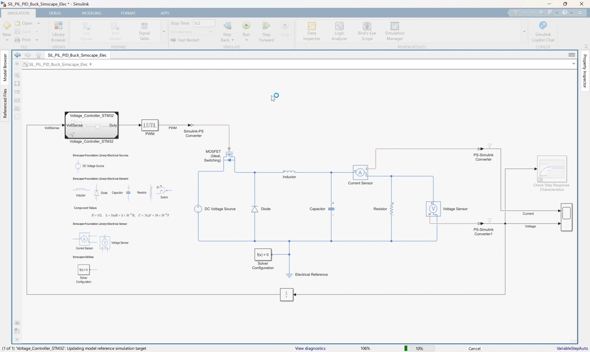

*Video screenshot: controller reference separated from the Simscape buck converter plant.*

Explain the separation:

```text
Plant: Simscape buck converter, PWM, MOSFET, sensors
Controller: Voltage_Controller_STM32 referenced model
```

The plant remains simulated in Simulink/Simscape. The controller can be run either as model behavior or as generated code.

### 3. Run a baseline model simulation

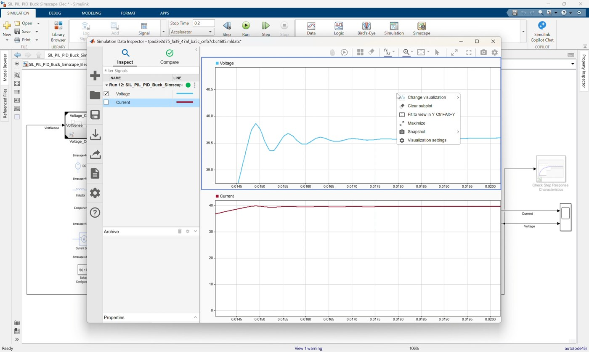

*Video screenshot: baseline response before switching the controller reference into SIL mode.*

1. Keep the Model Reference in normal/model simulation mode if the clip starts from a baseline check.
2. Run the model.
3. Open the Scope or Simulation Data Inspector.
4. Confirm the output voltage tracks the target near `40 V`.
5. Use this run as the reference behavior before SIL.

This step confirms the model reference is connected correctly before switching to generated-code execution.

### 4. Open the controller reference model

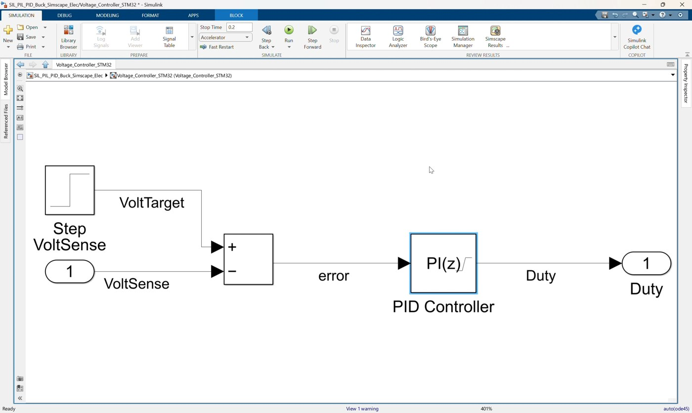

*Video screenshot: `Voltage_Controller_STM32` reference model with `VoltSense` input and `Duty` output.*

1. Open:

   ```text
   Voltage_Controller_STM32.slx
   ```

2. Review the controller interface:
   - Inport: `VoltSense`
   - Outport: `Duty`
3. Review the control logic:

   ```text
   Step target -> Subtract -> PID Controller -> Duty
   ```

4. Confirm the PID controller uses `Kp` and `Ki`.
5. Confirm output saturation limits duty to the `0` to `1` range.

### 5. Review code generation settings

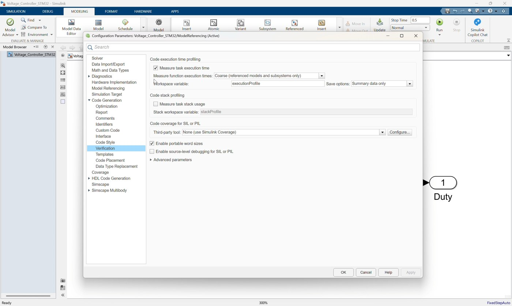

*Video screenshot: model settings for embedded code generation and STM32 target configuration.*

Open Model Settings for `Voltage_Controller_STM32.slx`.

Confirm solver settings:

```text
Solver type = Fixed-step
Solver = FixedStepAuto
Fixed-step size = 0.0001
```

Confirm code generation settings:

```text
System target file = ert.tlc
Language = C
Code interface packaging = Nonreusable function
Hardware board = STM32G4xx Based
Production hardware = ARM Compatible -> ARM Cortex-M
```

Confirm reporting and traceability are enabled:

```text
Create code generation report = on
Traceability = on
```

### 6. Review the STM32 project configuration

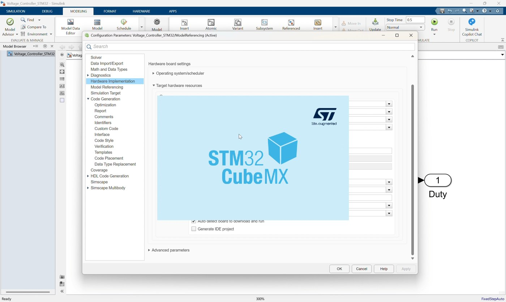

*Video screenshot: STM32CubeMX project configuration associated with the controller model.*

Open or review:

```text
Voltage_Controller_Project\Voltage_Controller_Project.ioc
```

Use this section to show that the generated embedded project is associated with the STM32 target configuration.

Key points to mention:

- Board: `B-G474E-DPOW1`.
- MCU: `STM32G474R(B-C-E)Tx`.
- Toolchain: `STM32CubeIDE`.
- Firmware package: `STM32Cube FW_G4 V1.6.0`.
- Project folder is already prepared for this workshop.

If STM32CubeMX opens during the video flow, use it only to review the project configuration. Do not change hardware settings during the SIL lesson unless required by the local setup.

### 7. Build or confirm generated code

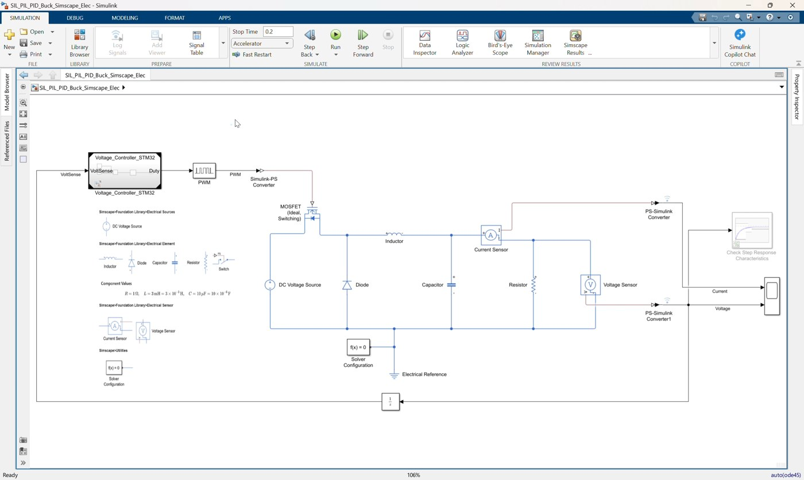

*Video screenshot: generated code/build artifacts created for `Voltage_Controller_STM32`.*

1. Build the referenced model or let the SIL workflow build it automatically.
2. Confirm generated code exists under:

   ```text
   slprj\ert\Voltage_Controller_STM32
   ```

3. Important generated files include:

   ```text
   Voltage_Controller_STM32.c
   Voltage_Controller_STM32.h
   codedescriptor.dmr
   buildInfo.mat
   ```

4. SIL build artifacts are stored under:

   ```text
   slprj\ert\Voltage_Controller_STM32\sil
   ```

5. Confirm the SIL executable is available:

   ```text
   Voltage_Controller_STM32.exe
   ```

### 8. Switch the Model Reference to SIL mode

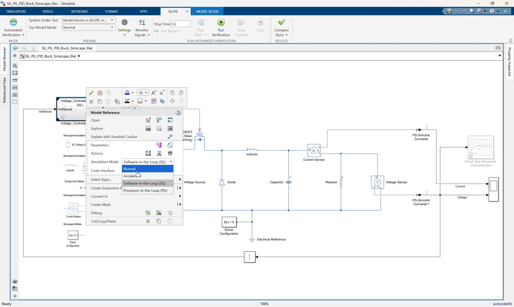

*Video screenshot: selecting `Software-in-the-loop (SIL)` for the controller Model Reference block.*

1. Return to:

   ```text
   SIL_PIL_PID_Buck_Simscape_Elec.slx
   ```

2. Select the `Voltage_Controller_STM32` Model Reference block.
3. Open the model reference simulation mode menu.
4. Select:

   ```text
   Software-in-the-loop (SIL)
   ```

Important note:

```text
The saved model may show Processor-in-the-loop (PIL) because Workshop 06 continues from this model.
For Workshop 05, select and demonstrate SIL first.
```

### 9. Run SIL simulation

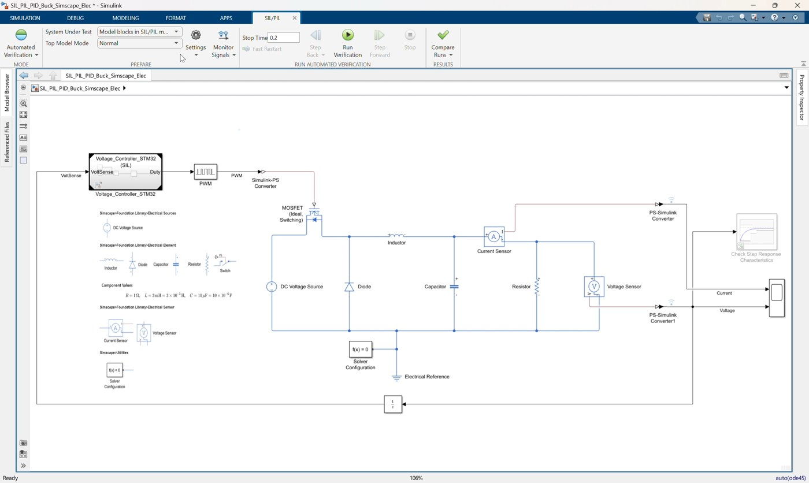

*Video screenshot: running the top-level model with the controller executed as generated SIL code.*

1. Run the top-level model.
2. Let Simulink build or reuse the generated controller code.
3. During SIL, the controller behavior is executed from compiled generated C code on the host.
4. The Simscape plant still runs in the top-level simulation.
5. Open the Scope or Simulation Data Inspector.
6. Confirm the voltage and current responses are consistent with the baseline model simulation.

Expected result:

```text
SIL behavior should closely match the model-level controller behavior.
```

### 10. Compare SIL result with model simulation

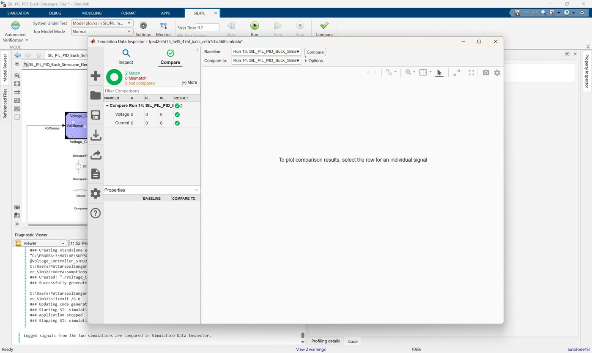

*Video screenshot: Simulation Data Inspector comparison after the SIL run.*

Use Simulation Data Inspector or Scope results to compare:

| Case | Controller Execution |
|---|---|
| Baseline/MIL-style run | Simulink referenced model behavior |
| SIL run | Generated C code compiled and executed on the host |

Check:

- Output voltage reaches near `40 V`.
- Current response remains reasonable.
- No code generation or SIL runtime errors occur.
- Controller duty output remains bounded through saturation.

### 11. Open generated code report

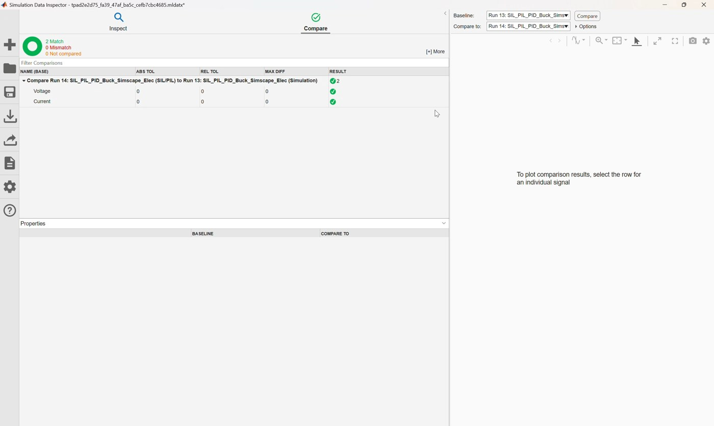

*Video screenshot: generated code report for the controller reference model.*

1. Open the generated code report for `Voltage_Controller_STM32`.
2. Review:
   - Generated C file.
   - Generated header file.
   - Model interface.
   - Entry-point functions.
   - Traceability links.

Use the report to explain that SIL is executing code generated from the same referenced controller model.

### 12. Demonstrate model-to-code traceability

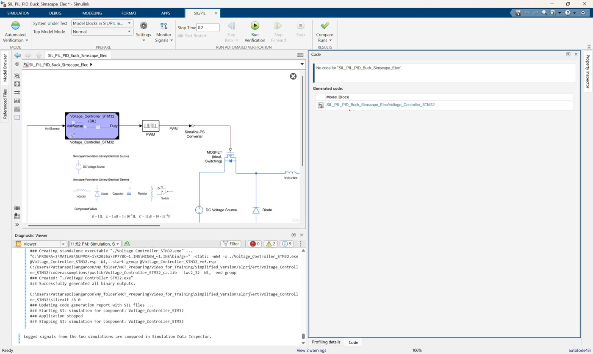

*Video screenshot: navigating from model elements to generated C code.*

1. Select a model element such as:
   - `Step`
   - `Subtract`
   - `PID Controller`
   - `Duty` Outport
2. Navigate from the model to the generated C code.
3. Point out code sections that compute:
   - Voltage error.
   - PI controller output.
   - Duty saturation.

Example concept:

```text
VoltSense input -> error calculation -> PI controller -> saturated Duty output
```

### 13. Demonstrate code-to-model traceability

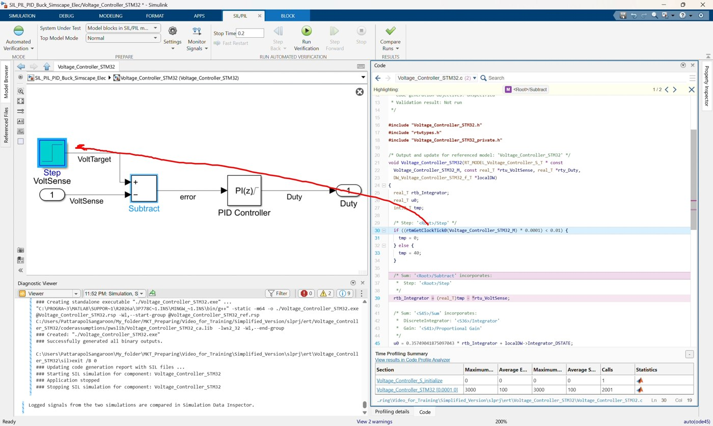

*Video screenshot: navigating from generated C code back to the Simulink model.*

1. Select a line in the generated C code.
2. Navigate back to the corresponding Simulink block.
3. Explain that traceability helps review generated embedded code and supports debugging or code review.

### 14. Inspect code execution profiling

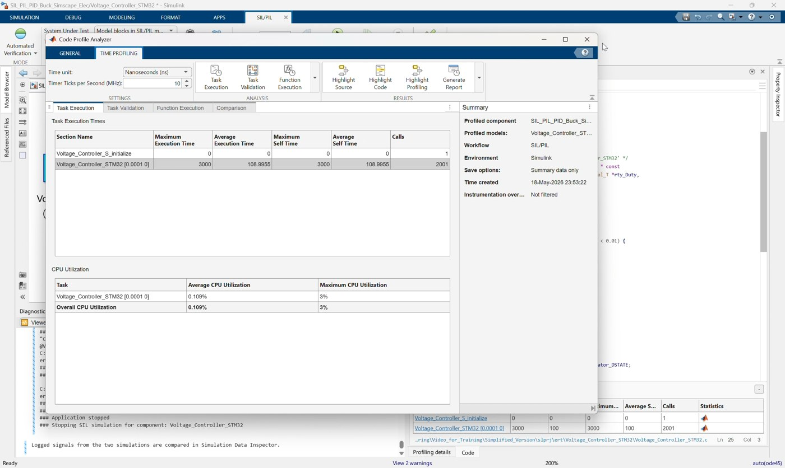

*Video screenshot: code execution profiling/analyzer results after SIL verification.*

1. Confirm code execution profiling is enabled in the top model.
2. Run or reuse the SIL run.
3. Open the execution profiling or code execution analyzer view.
4. Inspect timing results for the generated controller code.

Use this discussion:

- SIL can verify generated-code behavior before hardware is involved.
- Profiling gives an estimate of generated-code execution cost.
- This is useful before moving to processor-in-the-loop (PIL) in the next workshop.

## Suggested Instructor Flow

1. Open `SIL_PIL_PID_Buck_Simscape_Elec.slx`.
2. Identify the `Voltage_Controller_STM32` Model Reference block.
3. Run or show the baseline model simulation result.
4. Open `Voltage_Controller_STM32.slx` and review its controller interface.
5. Review solver, code generation, STM32 target, report, and traceability settings.
6. Show the prepared `Voltage_Controller_Project` folder and `.ioc` project.
7. Build or confirm generated code for the controller reference model.
8. Switch the Model Reference simulation mode to `Software-in-the-loop (SIL)`.
9. Run the top-level SIL simulation.
10. Compare SIL output voltage/current with the baseline run.
11. Open the generated code report.
12. Demonstrate model-to-code and code-to-model traceability.
13. Open the execution profiling/analyzer view.
14. Conclude by explaining that Workshop 06 moves from host-based SIL to processor-in-the-loop.

## Participant Exercise

Ask participants to compare these two runs:

| Case | Controller Execution | Expected Result |
|---|---|---|
| Baseline | Simulink Model Reference behavior | Reference controller response |
| SIL | Generated C code on host | Should closely match baseline |

For each case, record:

- Final output voltage.
- Current response shape.
- Whether the run completed without errors.
- Generated code folder location.
- One example of model-to-code traceability.
- One profiling result or execution metric if available.

## Troubleshooting

| Symptom | Likely Cause | Fix |
|---|---|---|
| SIL option is unavailable | Referenced model is not configured for code generation | Check `ert.tlc`, fixed-step solver, and code generation settings |
| Build fails because `Kp` or `Ki` is undefined | Controller gains are not visible to the referenced model | Define `Kp` and `Ki` in a visible workspace or model workspace |
| Build cannot find STM32 resources | STM32 project or support package path is not configured | Check `Voltage_Controller_Project`, STM32CubeMX, STM32CubeIDE, and firmware package setup |
| SIL run differs from baseline | Sample time, initialization, or parameter mismatch | Check Step settings, PID sample time, `Kp`, `Ki`, and saturation |
| Generated code report has no trace links | Traceability/report settings are disabled | Enable code generation report and traceability in `Voltage_Controller_STM32.slx` |
| Profiling data is missing | Code execution profiling is disabled or run was not instrumented | Enable profiling and rerun SIL |
| Model opens in PIL mode | Model was saved after Workshop 06 setup | Change the Model Reference simulation mode back to `Software-in-the-loop (SIL)` for this workshop |

## Reference Check

Top-level model should use this structure:

```text
Voltage Sensor -> PS-Simulink Converter1 -> Unit Delay -> Voltage_Controller_STM32.VoltSense
Voltage_Controller_STM32.Duty -> PWM -> Simulink-PS Converter -> MOSFET gate
Simscape buck converter plant remains in the top model
```

Referenced model should use this structure:

```text
VoltSense -> Subtract negative input
Step target -> Subtract positive input
Subtract -> PID Controller(P=Kp, I=Ki) -> Duty
```

Generated-code artifacts should exist under:

```text
slprj\ert\Voltage_Controller_STM32
slprj\ert\Voltage_Controller_STM32\sil
```

Key SIL concept:

```text
The plant is still simulated in Simulink/Simscape.
Only the controller reference is replaced by compiled generated C code.
```
