# Workshop 06: Run PIL Simulation for the Buck Converter Controller

## Goal

Run processor-in-the-loop (PIL) verification for the generated C code of the buck converter voltage controller. This workshop follows the clip `06_PIL_PID_Buck_Simscape_Elec.mp4`.

Start from:

```text
SIL_PIL_PID_Buck_Simscape_Elec.slx
```

Use the referenced controller model:

```text
Voltage_Controller_STM32.slx
```

Use the STM32 project configuration in:

```text
Voltage_Controller_Project\
```

There is no separate finished model for this workshop. The purpose is to show how to run the generated controller code on the STM32 target board while the Simscape buck converter plant continues to run in the host Simulink simulation.

By the end of this workshop, participants should be able to:

- Identify the controller Model Reference used for PIL simulation.
- Explain the difference between SIL and PIL simulation.
- Confirm the STM32 target and communication settings used by the referenced controller model.
- Run the controller as generated code on the STM32 board in PIL mode.
- Compare PIL results against the host simulation result.
- Inspect PIL profiling results in Code Profile Analyzer.

## Prerequisites

- MATLAB with Simulink.
- Simscape and Simscape Electrical.
- Embedded Coder.
- STM32 support package.
- STM32CubeMX and STM32CubeIDE setup.
- Supported STM32 board connected to the computer.
- Correct serial communication port selected for the board.
- Simulink model files in `Simplified_Version`.
- STM32 project folder `Simplified_Version\Voltage_Controller_Project`.

## Starting Files

| File or Folder | Purpose |
|---|---|
| `SIL_PIL_PID_Buck_Simscape_Elec.slx` | Top-level buck converter plant and controller reference test model |
| `Voltage_Controller_STM32.slx` | Referenced PI voltage controller model used for code generation and PIL |
| `Voltage_Controller_Project\` | STM32CubeMX/STM32CubeIDE project configuration |
| `slprj\ert\Voltage_Controller_STM32\` | Generated Embedded Coder files |
| `slprj\ert\Voltage_Controller_STM32\pil\` | PIL build artifacts, target executable files, and profiling data |

## Model Structure

The top-level model contains the Simscape buck converter plant and a Model Reference block named `Voltage_Controller_STM32`.

Top-level signal flow:

```text
Voltage Sensor -> PS-Simulink Converter1 -> Unit Delay -> Voltage_Controller_STM32 input VoltSense
Voltage_Controller_STM32 output Duty -> PWM -> Simulink-PS Converter -> MOSFET gate
Current Sensor -> PS-Simulink Converter -> Scope input 1
Voltage Sensor -> PS-Simulink Converter1 -> Scope input 2
```

The referenced controller model contains:

```text
Inport VoltSense
Step target -> Subtract -> PID Controller -> Outport Duty
```

Detected controller settings:

| Item | Value |
|---|---:|
| Step time | `0.01 s` |
| Step initial value | `0` |
| Step final value | `40` |
| Controller type | `PI` |
| Proportional gain | `Kp` |
| Integral gain | `Ki` |
| Initial `Kp` | `1` |
| Initial `Ki` | `1` |
| Controller sample time | `1e-4 s` |
| Output lower saturation | `0` |
| Output upper saturation | `1` |

## Reference Configuration

Top-level model settings:

| Item | Value |
|---|---:|
| Model | `SIL_PIL_PID_Buck_Simscape_Elec.slx` |
| Simulation mode | `accelerator` |
| Stop time | `0.2 s` |
| Code execution profiling | `on` |
| Profiling variable | `executionProfile` |

Referenced controller model settings:

| Item | Value |
|---|---:|
| Model | `Voltage_Controller_STM32.slx` |
| Solver type | Fixed-step |
| Solver | `FixedStepAuto` |
| Fixed-step size | `0.0001` |
| System target file | `ert.tlc` |
| Language | `C` |
| Code interface packaging | Nonreusable function |
| Hardware board | `STM32G4xx Based` |
| Production hardware | `ARM Compatible -> ARM Cortex-M` |
| Code generation report | `on` |
| Traceability | `on` |

STM32 project details detected from `Voltage_Controller_Project.ioc`:

| Item | Value |
|---|---|
| Project name | `Voltage_Controller_Project` |
| Board | `B-G474E-DPOW1` |
| MCU | `STM32G474R(B-C-E)Tx` |
| Package | `LQFP64` |
| STM32CubeMX version | `6.12.0` |
| Firmware package | `STM32Cube FW_G4 V1.6.0` |
| Target toolchain | `STM32CubeIDE` |
| PIL communication interface | `USART3` |
| USART3 pins | `PC10 = USART3_TX`, `PC11 = USART3_RX` |
| USART3 frequency | `170000000` |

## SIL and PIL Difference

| Mode | Controller Code Runs On | Plant Runs On | Purpose |
|---|---|---|---|
| SIL | Host computer | Host Simulink/Simscape simulation | Verify generated C code behavior on the host |
| PIL | STM32 target board | Host Simulink/Simscape simulation | Verify generated C code behavior on the real processor |

In this workshop, only the controller reference is executed on the STM32 board. The buck converter plant remains simulated in Simulink/Simscape on the host computer.

## Workshop Procedure

Follow this order in the workshop:

```text
Open top model -> Review Model Reference -> Select PIL mode
-> Review STM32 target hardware resources -> Open controller model
-> Confirm controller/code generation settings -> Run PIL simulation
-> Wait for build, deploy, and target execution -> Compare simulation and PIL results
-> Open Code Profile Analyzer -> Review task execution time and CPU utilization
```

### 1. Open the SIL/PIL top model

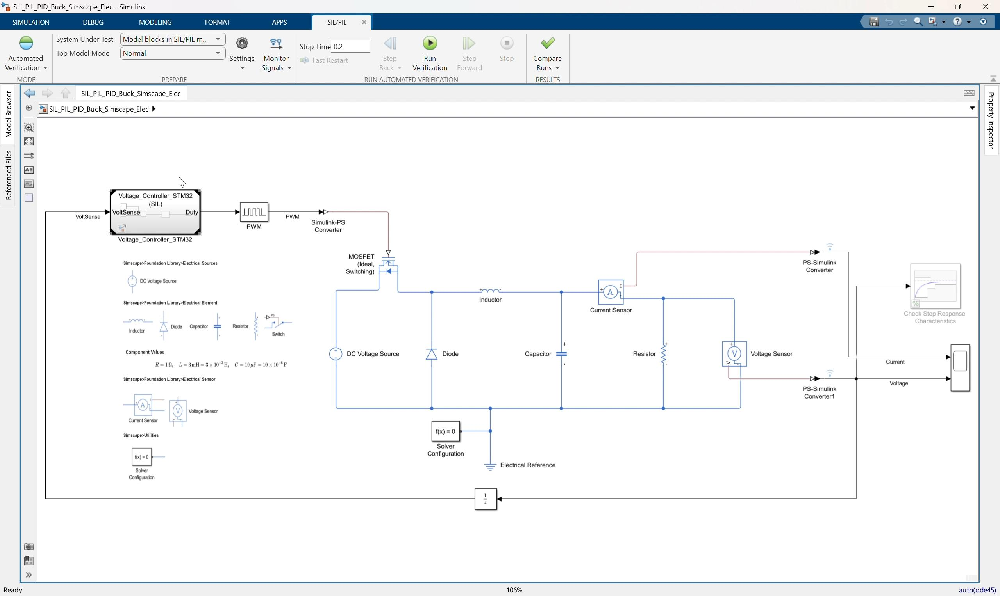

*Video screenshot: top-level buck converter model with the `Voltage_Controller_STM32` Model Reference block.*

1. Open:

   ```text
   SIL_PIL_PID_Buck_Simscape_Elec.slx
   ```

2. Locate the Model Reference block:

   ```text
   Voltage_Controller_STM32
   ```

3. Confirm the block input is `VoltSense`.
4. Confirm the block output is `Duty`.
5. Confirm `Duty` connects to the `PWM` block.
6. Confirm the top-level stop time is:

   ```text
   0.2
   ```

### 2. Review the closed-loop plant and controller boundary

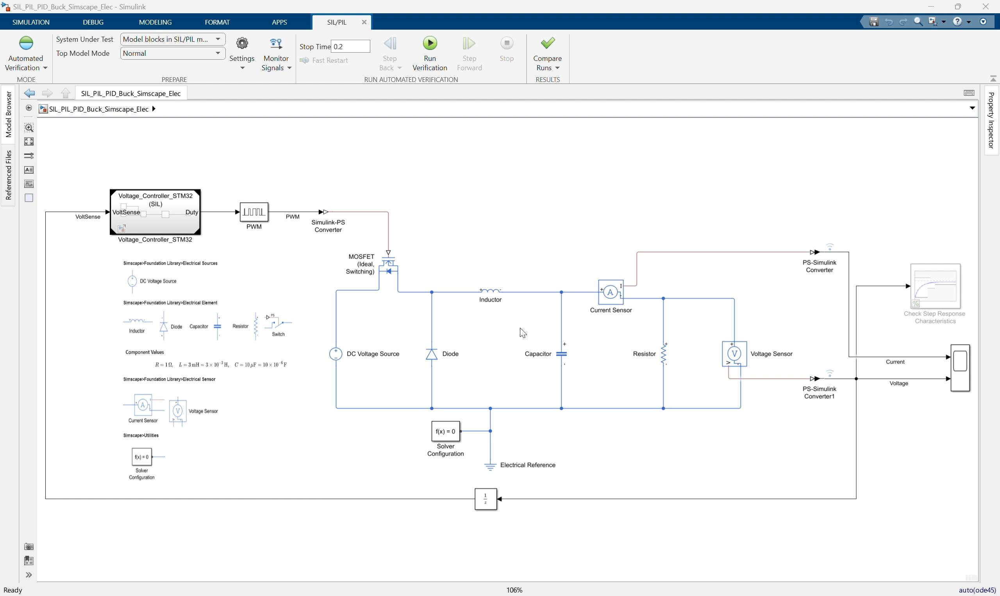

*Video screenshot: Simscape buck converter plant connected to the referenced STM32 voltage controller.*

Explain the separation:

```text
Plant: Simscape buck converter, PWM, MOSFET, sensors
Controller: Voltage_Controller_STM32 referenced model
```

The plant remains simulated in Simulink/Simscape. The controller reference is the part that will be replaced by generated embedded code running on the STM32 board.

### 3. Select Processor-in-the-loop mode

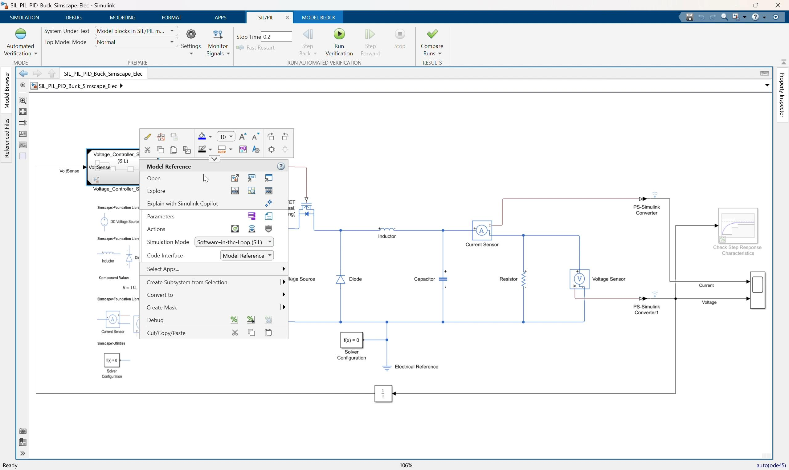

*Video screenshot: selecting the Model Reference simulation mode for the controller block.*

1. Select the `Voltage_Controller_STM32` Model Reference block.
2. Open the block context menu or Model Reference simulation mode menu.
3. Select:

   ```text
   Processor-in-the-loop (PIL)
   ```

4. Confirm the label on the Model Reference block indicates PIL execution.

Key explanation:

```text
In PIL mode, Simulink sends input data from the host simulation to the STM32 board.
The board executes the generated controller code and returns the output duty command to Simulink.
```

### 4. Open the controller model settings

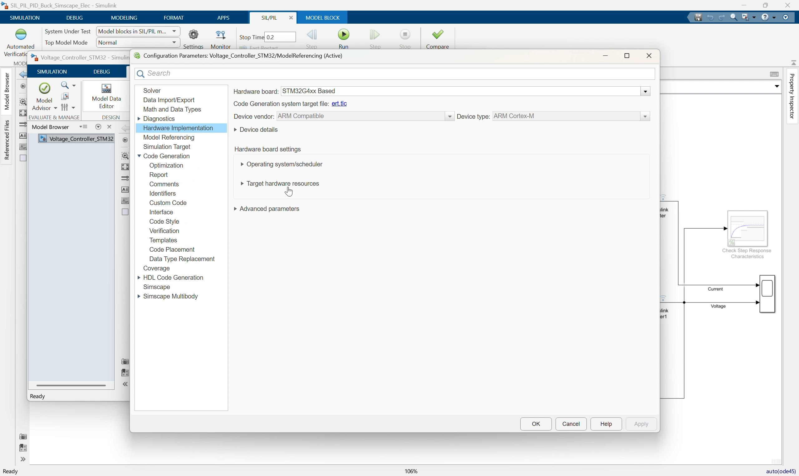

*Video screenshot: hardware implementation settings for the referenced STM32 controller model.*

1. Open the referenced controller model:

   ```text
   Voltage_Controller_STM32.slx
   ```

2. Open Model Settings.
3. Go to the code generation and hardware implementation settings.
4. Confirm the target hardware is:

   ```text
   STM32G4xx Based
   ```

5. Confirm the production hardware is:

   ```text
   ARM Compatible -> ARM Cortex-M
   ```

### 5. Review target hardware resources

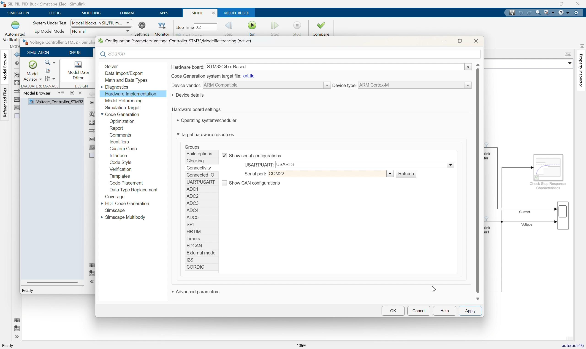

*Video screenshot: target hardware resource settings and communication configuration.*

In the video flow, the target hardware resource settings are reviewed before running PIL.

Check:

```text
Build options
Connectivity
USART / UART communication
COM port selection
```

Confirm the project is configured to use the prepared STM32 communication channel. From the project configuration, the communication interface is `USART3`.

Important notes for the instructor:

- The selected COM port depends on the local computer and connected board.
- If the board is moved to another USB port, the COM port may change.
- The model should use the COM port that appears in Windows Device Manager for the connected STM32 board.
- Do not change the CubeMX hardware configuration during this lesson unless the local board setup requires it.

### 6. Review the referenced controller logic

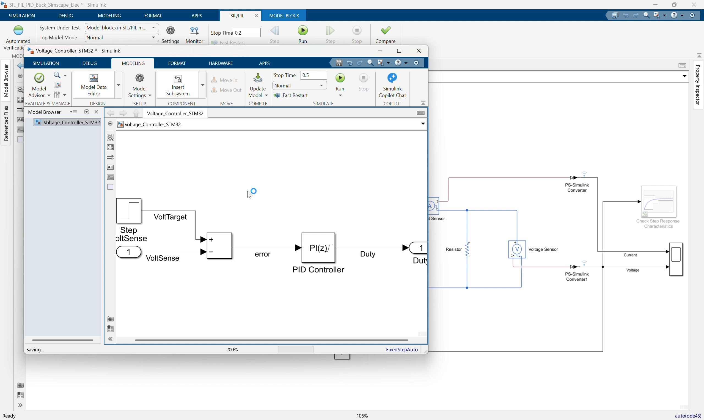

*Video screenshot: `Voltage_Controller_STM32` referenced model with step target, error calculation, and PI controller.*

In `Voltage_Controller_STM32.slx`, review the controller interface:

```text
Inport: VoltSense
Outport: Duty
```

Review the control logic:

```text
Step target -> Subtract -> PID Controller -> Duty
```

Confirm:

- The target voltage step goes from `0` to `40`.
- The measured voltage enters the negative input of the `Subtract` block.
- The PID block is configured as a PI controller.
- The PI gains are `Kp` and `Ki`.
- The duty output is saturated from `0` to `1`.

### 7. Confirm generated code and PIL artifacts

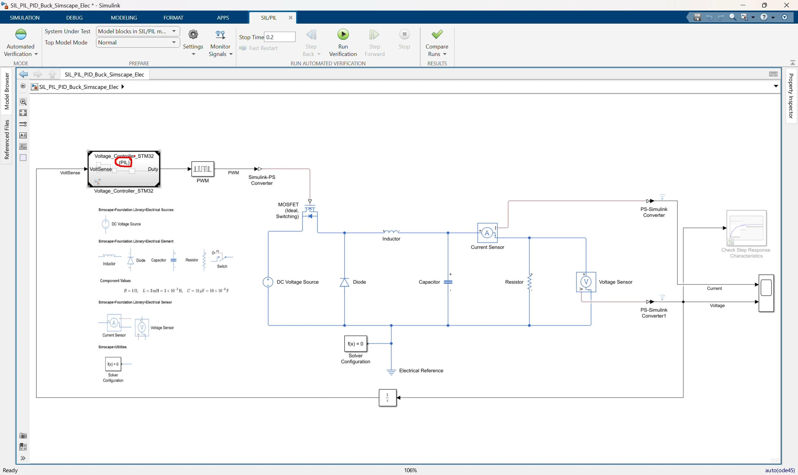

*Video screenshot: top-level model with the controller Model Reference set up for PIL execution.*

The generated controller code is under:

```text
slprj\ert\Voltage_Controller_STM32
```

Important generated files include:

```text
Voltage_Controller_STM32.c
Voltage_Controller_STM32.h
codedescriptor.dmr
MW_target_hardware_resources.h
```

PIL build artifacts are under:

```text
slprj\ert\Voltage_Controller_STM32\pil
```

Important PIL artifacts include:

```text
pil_main.c
Voltage_Controller_STM32.elf
Voltage_Controller_STM32.hex
Voltage_Controller_STM32.bin
Voltage_Controller_STM32_psf.c
profiling_info.mat
```

Use this step to explain that PIL creates a target application, downloads it to the STM32 board, and communicates with it during simulation.

### 8. Run the PIL simulation

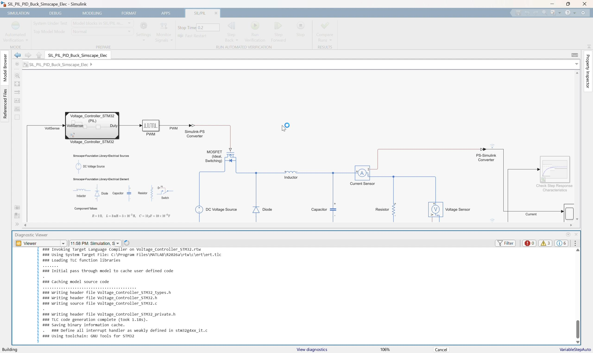

*Video screenshot: PIL run starting with build and diagnostic messages.*

1. Return to:

   ```text
   SIL_PIL_PID_Buck_Simscape_Elec.slx
   ```

2. Make sure the `Voltage_Controller_STM32` Model Reference block is in:

   ```text
   Processor-in-the-loop (PIL)
   ```

3. Click Run.
4. Allow Simulink to build or reuse generated code.
5. Allow the workflow to deploy the PIL application to the STM32 board.
6. Watch the Diagnostic Viewer for build, download, and run messages.

During this run:

```text
The host simulation sends VoltSense to the STM32 target.
The STM32 target executes the generated PI controller code.
The target returns Duty to the host simulation.
The host simulation continues the Simscape buck converter plant.
```

### 9. Wait for build, deploy, and target execution

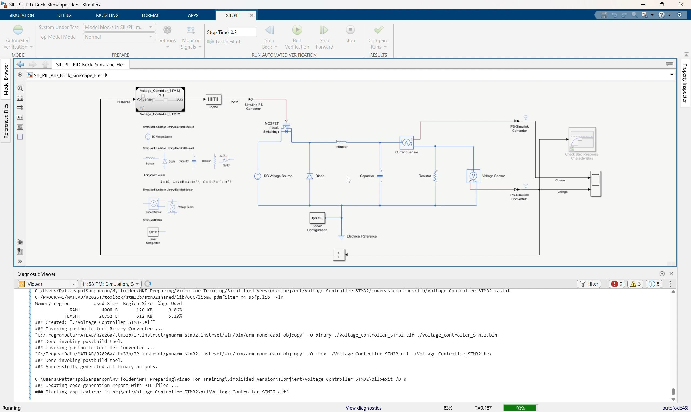

*Video screenshot: PIL simulation running after code generation, build, and target communication setup.*

The first PIL run can take longer because Simulink may need to:

- Generate code.
- Compile the target application.
- Link the STM32 executable.
- Download the application to the board.
- Start target communication.
- Run the closed-loop simulation.

Expected status messages include:

```text
Building
Compiling
Linking
Downloading
Running
```

If the model has already been built, the workflow may reuse existing generated code and start faster.

### 10. Compare simulation and PIL results

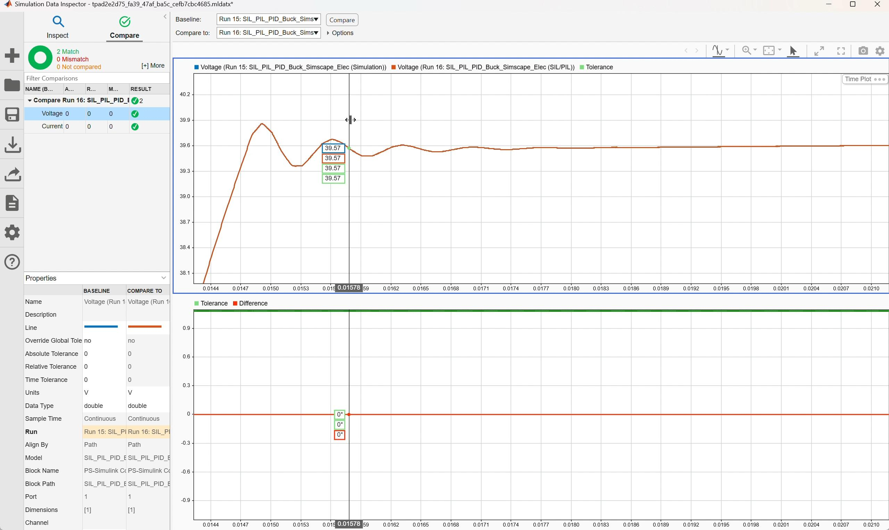

*Video screenshot: Simulation Data Inspector comparing voltage response between simulation and PIL runs.*

Open Simulation Data Inspector.

Compare:

| Case | Controller Execution |
|---|---|
| Simulation run | Simulink referenced model behavior |
| PIL run | Generated C code running on the STM32 processor |

Check the voltage response:

- The voltage rises toward the `40 V` target.
- The PIL trace should closely match the simulation trace.
- The difference plot should stay within the selected tolerance.

Check the current response:

- The current response shape should be consistent between simulation and PIL.
- Any visible difference should be small enough for the lesson objective.

Main discussion point:

```text
A close match means the generated code running on the real processor behaves like the controller model in the closed-loop simulation.
```

### 11. Open Code Profile Analyzer

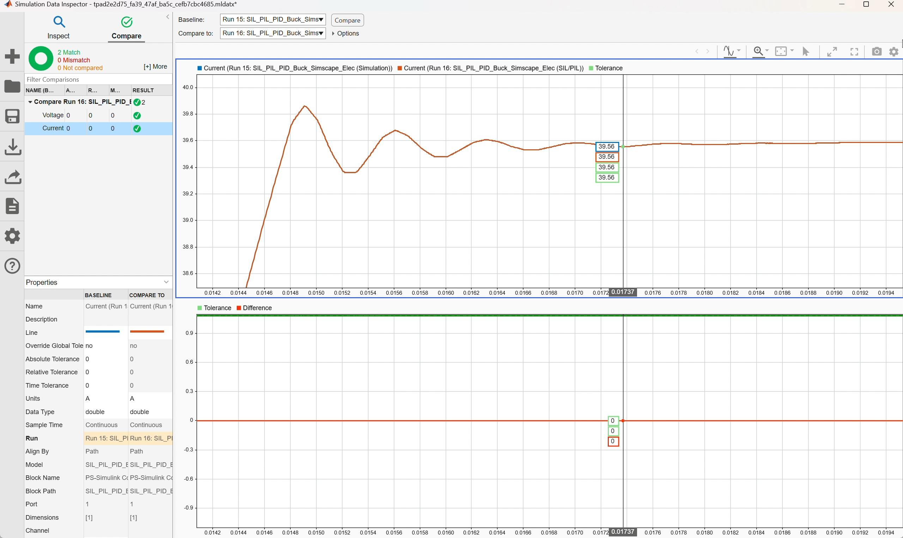

*Video screenshot: Simulation Data Inspector comparing current response between simulation and PIL runs.*

After the PIL run completes, open Code Profile Analyzer.

Review:

```text
Task execution time
Maximum execution time
Average execution time
Minimum execution time
Number of calls
CPU utilization
```

The video shows profiling for the `Voltage_Controller_STM32` PIL component.

Use this discussion:

- PIL verifies behavior on the actual processor.
- Profiling reports the measured execution cost on the target.
- This confirms whether the controller can run within the required sample time.

### 12. Interpret the profiling result

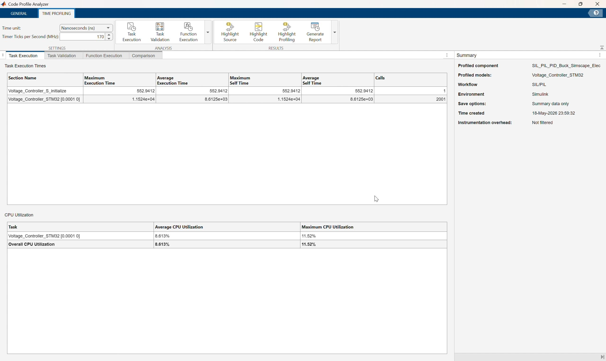

*Video screenshot: Code Profile Analyzer showing task execution time and CPU utilization for the PIL run.*

Compare the measured execution time with the controller sample time:

```text
Controller sample time = 0.0001 s
```

If the measured maximum execution time is below the sample time, the controller has timing margin for this configuration.

Also review CPU utilization:

```text
Average CPU utilization
Maximum CPU utilization
Overall CPU utilization
```

Explain that PIL profiling is more hardware-representative than SIL profiling because the controller code is executing on the STM32 processor instead of the host computer.

## Suggested Instructor Flow

1. Open `SIL_PIL_PID_Buck_Simscape_Elec.slx`.
2. Identify the `Voltage_Controller_STM32` Model Reference block.
3. Explain the plant/controller boundary.
4. Select or confirm `Processor-in-the-loop (PIL)` mode for the Model Reference block.
5. Open `Voltage_Controller_STM32.slx`.
6. Review STM32 code generation and hardware resource settings.
7. Confirm the communication interface and COM port for the connected board.
8. Review the PI controller interface and logic.
9. Return to the top model and run the PIL simulation.
10. Wait for code generation, build, download, and target execution.
11. Open Simulation Data Inspector and compare simulation versus PIL traces.
12. Open Code Profile Analyzer and review execution time and CPU utilization.
13. Conclude by explaining that PIL confirms generated-code behavior on the real embedded processor.

## Participant Exercise

Ask participants to compare these two runs:

| Case | Controller Execution | Expected Result |
|---|---|---|
| Simulation | Simulink Model Reference behavior | Reference controller response |
| PIL | Generated C code on STM32 board | Should closely match simulation |

For each case, record:

- Final output voltage.
- Current response shape.
- Whether the run completed without errors.
- Selected COM port.
- Generated PIL artifact folder.
- Maximum task execution time.
- Average CPU utilization.

## Troubleshooting

| Symptom | Likely Cause | Fix |
|---|---|---|
| PIL option is unavailable | Referenced model is not configured for code generation | Check `ert.tlc`, fixed-step solver, and code generation settings |
| Build fails because `Kp` or `Ki` is undefined | Controller gains are not visible to the referenced model | Define `Kp` and `Ki` in a visible workspace or model workspace |
| Build cannot find STM32 resources | STM32 support package, CubeMX, CubeIDE, or project path is not configured | Check support package installation and `Voltage_Controller_Project` |
| Download fails | Board is disconnected, busy, or the wrong COM port is selected | Reconnect the board and select the correct COM port |
| PIL communication times out | Serial interface or target communication setting is wrong | Check USART/UART selection, COM port, cable, and board power |
| PIL run differs from simulation | Sample time, parameter, initialization, or data type mismatch | Check Step settings, PID sample time, `Kp`, `Ki`, saturation, and generated-code settings |
| Profiling data is missing | Code execution profiling is disabled or the run did not complete | Enable profiling and rerun PIL |
| Code Profile Analyzer shows high utilization | Controller execution time is close to or above sample time | Review generated code, sample time, target clock, and compiler optimization |

## Reference Check

Top-level model should use this structure:

```text
Voltage Sensor -> PS-Simulink Converter1 -> Unit Delay -> Voltage_Controller_STM32.VoltSense
Voltage_Controller_STM32.Duty -> PWM -> Simulink-PS Converter -> MOSFET gate
Simscape buck converter plant remains in the top model
```

Referenced model should use this structure:

```text
VoltSense -> Subtract negative input
Step target -> Subtract positive input
Subtract -> PID Controller(P=Kp, I=Ki) -> Duty
```

Generated-code artifacts should exist under:

```text
slprj\ert\Voltage_Controller_STM32
slprj\ert\Voltage_Controller_STM32\pil
```

Key PIL concept:

```text
The plant is still simulated in Simulink/Simscape.
Only the controller reference is replaced by generated code running on the STM32 target processor.
```
